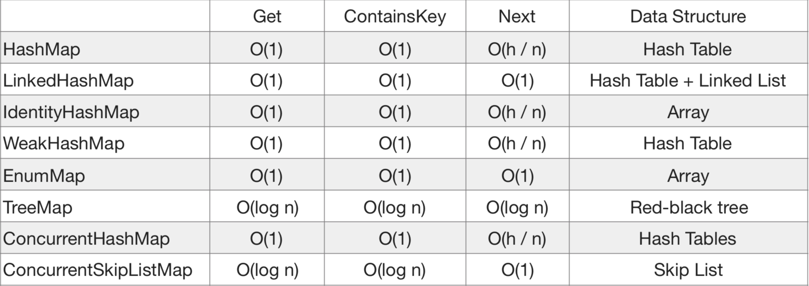
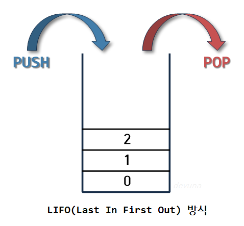

## Array, ArrayList, LinkedList


| 특징 및 시간 복잡도 \ 자료구조  | Array | ArrayList                                          | LinkedList |
|---------------------|-------|----------------------------------------------------|------------|
| 저장 공간 크기            | 고정적   | 가변적                                                | 가변적        | 
| 물리주소와 논리주소 동일 여부    | O     | O                                                  | X          |
| 메모리 공간의 연속성         | O     | O                                                  | X          |
| 특정 위치에 있는 원소에 대한 접근 | O(1)  | O(1)                                               | O(n)       |
| 특정 위치에 있는 원소에 대한 수정 | O(1)  | O(1)                                               | O(n)       |
| 특정 원소를 탐색           | O(n)  | O(n)                                               | O(n)       |
| 맨 앞에 원소 추가          | O(n)  | O(n)                                               | O(1)       |
| 맨 뒤에 원소 추가          | O(1)  | Amortized O(1)                                     | O(1)       |
| 중간에 원소 삽입           | O(n)  | O(n)                                               | O(n)       |
| 맨 앞의 원소 삭제          | O(n)  | O(n)                                               | O(1)       |
| 맨 뒤의 원소 삭제          | O(1)  | remove(int index): O(1)<br/>remove(Object o): O(n) | O(1)       |
| 중간에서 원소 삭제          | O(n)  | O(n)                                               | O(n)       |

### Array vs LinkedList

- (이미 데이터셋이 만들어진 상태에서) 데이터에 대한 접근이 잦은 경우: 배열
- (이미 데이터셋이 만들어진 상태에서) 데이터 수정이 잦은 경우: 배열
- 데이터의 추가가 잦은 경우: 연결 리스트
- 데이터의 삽입이 잦은 경우: 연결 리스트
- 데이터의 삭제가 잦은 경우: 연결 리스트

**배열의 삽입 과정**

```
if(삽입하고자 하는 인덱스 뒤에 모든 원소가 가득 차있을 경우) {
  1. 기존의 배열보다 큰 사이즈를 가진 배열 선언
  2. 기존 배열의 원소를 새로운 배열에 복사하며 기존 삽입하고자 하는 인덱스에 알맞은 값 삽입
    -> 확정적으로 N의 시간 소요
  3. 기존의 배열을 GC가 수거
} else {
   1. 삽입하고자 하는 인덱스 뒤에 있는 모든 원소를 뒤로 한 카닉 밀면서 재할당
    -> 최악의 경우 N의 시간 소요
   2. 삽입하고자 하는 인덱스에 원하는 값을 삽입
  }
```

**연결리스트의 삽입 과정**
```
if(원소를 삽입하려는 위치와 연결 리스트의 사이즈를 비교했을 때, first 노드에서 시작하는 게 좋을 때) {
  1. first 노드붜 next를 타고 흘러가며 원소를 삽입하려는 위치까지 이동
  2. 해당 위치에 있는 기존 노드와 next, prev, 삽입하고자 했떤 노드의 next와 prev 수정
} else {
    1. last 노드부터 prev를 타고 흘러가며 원소를 삽입하려는 위치까지 이동
    2. 해당 위치에 있는 기존 노드의 next와 prev, 삽입하고자 했던 노드의 next와 prev 수정
  }
```

확정적으로 N/2 시간이 소요됨


**references** <br>
https://dev-coco.tistory.com/19 <br>
https://devlog-wjdrbs96.tistory.com/64 <br>
https://mong9data.tistory.com/132

---

## HashTable, HashMap

> 동기화 지원 여부에 차이가 있다.

HashTable 클래스는 컬렉션 프레임웍이 만들어지기 이전부터 존재했으며, 자바에서 해시 테이블을 구현한 클래스 중 가장 오래됐다.

vector의 상위 호환 개념인 ArrayList의 사용을 권장하듯, 새로운 버전인 HashMap을 주로 사용하고 동기화가 필요하면 ConcurrentHashMap을 사용하는 게 더 좋은 방법이라고 한다.

구형인 HashTable은 동기화 처리 비용 문제로 HashMap에 비해 느리다.


|                | HashMap            | HashTable      |
|----------------|--------------------|----------------|
| Thread-safe    | X                  | O              |
| 키에 Null 값 허용   | O                  | X              |
| Enumeration 여부 | Fail-Fast Iterator | Enumeration 제공 |
| 보조해시           | O                  | X              |


- Thread-safe
  - Hashtable은 동기화를 지원해 thread-safe 하다.
  - 멀티스레드 환경이 아니라면 Hashtable은 HashMap보다 성능이 떨어진다.


- 보조해시
  - 해시맵은 보조해시를 사용하기 떄문에 보조해시 함수를 사용하지 않는 해시테이블에 비해 해시 충돌이 덜 발생할 수 있어 성능상 이점이 있다.


- Enumeration
  - `Fail-Fast Iterator` 빠른 에러를 발생시켜 버그를 예방할 수 있다.
  - `Enumeration`을 사용한 코드는 중간에 remove를 해도 예외가 발생하지 않기 때문에 나중에 버그를 발견하지 못할 확률이 존재한다.




**references** <br>
https://devlog-wjdrbs96.tistory.com/253 <br>
https://memostack.tistory.com/233 <br>
https://yaelimeee.tistory.com/25 <br>  

---

## Stack / Queue




### 활용

- 스택
  - 웹 브라우저 방문기록(뒤로 가기): 가장 나중에 열린 페이지부터 다시 보여준다.
  - 역순 문자열 만들기
  - 실행 취소(undo)
  - 후위 표기법 계산
  - 수식의 괄호 검사(연산자 우선순위 표현을 위한 괄호 검사)


- 큐: 주로 데이터가 이볅된 시간 순서대로 처리할 필요가 있는 상황에 이용
  - 우선순위가 같은 작업 예약(프린터의 인쇄 대기열)
  - 은행 업무
  - 콜센터 고객 대기시간
  - 프로세스 관리
  - 너비 우선 탐색(BFS, Breadth-First Search) 구현
  - 캐시 구현