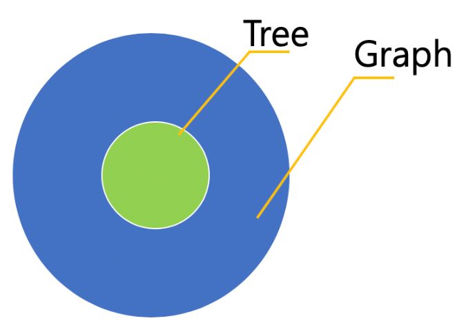
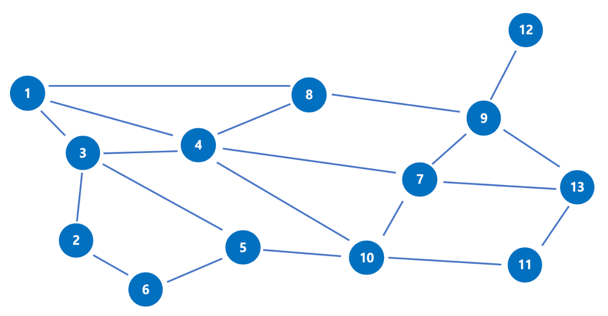
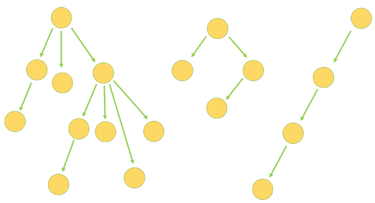
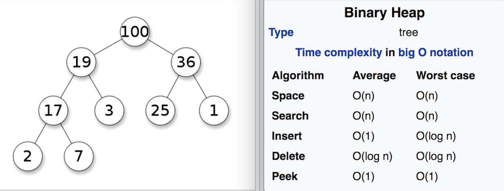
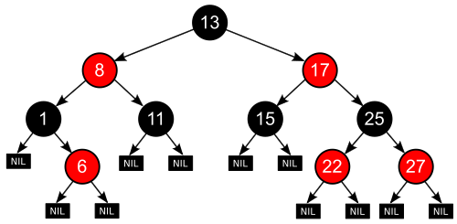
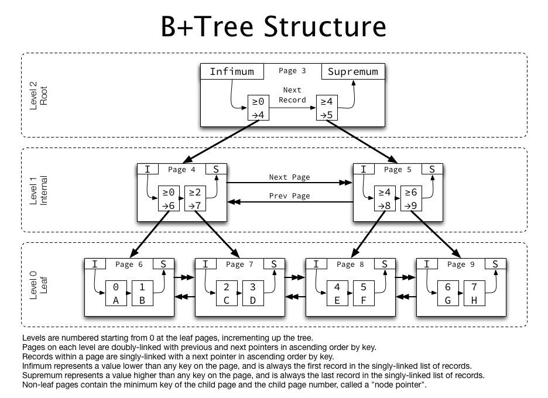

## Graph, Tree



### Graph



- 노드와 노드 간을 연결하는 간선으로 구성된 자료 구조

**특징**
- 순환 혹은 비순환 구조를 이룬다.
- 방향이 있는 그래프와 방향이 없는 그래프가 있다.
- 루트 노드의 개념이 없다. 즉 부모-자식 관계 개념이 없다.
- 2개 이상의 경로가 가능하다(무방향, 방향, 양방향)
- 네트워크 모델이다.

### Tree



- 그래프와 같이 노드와 노드 간을 연결하는 간선으로 구성된 자료구조
- 그래프 중에서도 특수한 케이스에 해당하는 자료구조
- 두 개의 노드 사이에 반드시 1개의 경로만을 가지며 사이클이 존재하지 않는 방향 그래프로(**비순환**), 이러한 특성 떄문에 '최소 연결 트리'라고 부르기도 한다.
- 부모 자식 관계가 성립하기 때문에 계층형 모델이라고도 한다.


**특징**
- 부모-자식 관계가 존재해 레벨이 존재한다. (최상위 노드 = Root)
- 노드가 N개면 간선은 N-1개 / 각 레벨 k에 존재하는 노드는 2^k개(완전 이진 트리의 경우)
- 방향성이 존재하고 사이클은 존재하지 않는다. (비순환)
- 전위순회, 중위순회, 후위순회 존재


### 이진 탐색 트리

1. 각 노드에 중복되지 않는 키(key)가 있다.
2. 루트노드의 왼쪽 서브 트리는 해당 노드의 키보다 작은 키를 갖는 노드들로 이루어져 있다.
3. 루트노드의 오른쪽 서브 트리는 해당 노드의 키보다 큰 키를 갖는 노드들로 이루어져 있다.
4. 좌우 서브 트리도 모두 이진 탐색 트리여야 한다.

---

## Heap

- 트리 기반 자료구조로 힙 속성을 만족하는 거의 완전한 트리
- 가장 큰 값이나 가장 작은 값을 빠르게 찾아내도록 만들어진 자료 구조
- 최대힙과 최소힙으로 나누어지는데, 최대힙은 자식 노드보다 부모 노드의 값이 크고, 최소힙은 자식 노드보다 부모 노드의 값이 작다.
- 중복 허용
- 느슨한 자료구조: 큰 값이 상위 레벨에 있고 작은 값이 하위 레벨에 있는 정도
- 완전 이진 트리: 모든 레벨의 노드가 채워져있어야 하며, 마지막 레벨은 왼쪽부터 차있어야 한다.
- 시간 복잡도
  - 삽입, 삭제: O(logn)
  - 정렬: O(nlogn)



**references** <br>
https://kayuse88.github.io/binary-heap/ <br>
https://velog.io/@gnwjd309/data-structure-heap <br>
https://code-lab1.tistory.com/10

---

## Red-Black Tree



- 자가 균형 탐색 이진 트리

```
1. 모든 노드는 빨간색 혹은 검은색이다.
2. 루트 노드는 검은색이다.
3. 모든 리프 노드(NIL)들은 검은색이다. (NIL : null leaf, 자료를 갖지 않고 트리의 끝을 나타내는 노드)
4. 빨간색 노드의 자식은 검은색이다.
   == No Double Red(빨간색 노드가 연속으로 나올 수 없다)
5. 모든 리프 노드에서 Black Depth는 같다.
   == 리프노드에서 루트 노드까지 가는 경로에서 만나는 검은색 노드의 개수가 같다.
```

- 이진 탐색 트리의 조회는 O(log n)의 시간이 걸리는데 균형이 무너질 경우 O(N)까지 시간이 증가할 수 있다.
- RB Tree의 가장 큰 특징은 삽입, 삭제 동안 트리의 모양이 균형 잡히도록 각 노드들은 red or black 색상을 가진다는 것이다.
- 따라서 검색, 삽입, 삭제 시 Worst Case에서도 O(log n)이 보장된다.

### 사용 예

1. map in C++
2. TreeMap in Java 8~

**references** <br>
https://suhwanc.tistory.com/197?category=730826

---

## B-Tree

출처: http://www.btechsmartclass.com/data_structures/b-trees.html

- Binary search tree와 유사하지만 한 노드 당 자식 노드가 2개 이상 가능하다.
- 균형이진트리의 연속이기에 균형을 유지하며, 따라서 아무리 최악의 경우라도 O(logN)의 검색 성능을 보여준다.
- 그러나 처음 생성 당시는 균형 트리지만 테이블 갱신의 반복을 통해 서서히 균형이 무너지고, 성능이 악화된다.
- 어느 정도 균형을 자동으로 회복하는 기능이 있지만, 갱신 빈도가 높은 테이블에 작성되는 인덱스 같은 경우 인덱스 재구성을 통해 트리의 균형을 되찾는 작업이 필요하다.


## B+Tree



- B-Tree의 확장 개념으로, internal 혹은 branch node에 key와 data를 담을 수 있는 B-Tree와 달리 브랜치 노드에 key만 담아두고 data는 담지 않는다.
- 오직 리프 노드에만 key와 data를 저장하고, 리프 노드끼리 Linked list로 연결돼 있다.
- MySQL의 DB engine이 B+Tree

**장점**
- 리프 노드를 제외하고 데이터를 담아두지 않기 때문에 메모리를 더 확보함으로써 더 많은 key들을 수용할 수 있다. 하나의 노드에 더 많은 key들을 담을 수 있기 때문에 트리의 높이는 더 낮아진다.(cache hit을 높일 수 있다.)
- 풀 스캔 시, B+Tree는 리프 노드에 데이터가 모두 있기 때문에 한 번에 선형탐색만 하면 된다. -> B-Tree에 비해 빠르다.

|              | B-Tree                                                                    | B+Tree                      |
|--------------|---------------------------------------------------------------------------|-----------------------------|
| 트리의 높이       | 높음                                                                        | 낮음(한 노드 당 key)를 많이 담을 수 있다. |
| 풀 스캔 시 검색 속도 | 모든 노드 탐색                                                                  | 리프 노드에서 선형 탐색               |
| 키 중복         | 없음                                                                        | 있음(리프 노드에 모든 데이터가 있기 때문에    |
| 검색           | 자주 access되는 노드를 루트 노드에 가까이 배치하여 루트 노드에서 가까울 경우, 브랜치 노드에도 데이터가 존재하기 때문에 빠름 | 리프 노드까지 가야 데이터 존재           |
| 더블 링크드 리스트   | 없음                                                                        | 리프 노드끼리 링크드 리스트로 연결돼있음      |

**references** <br>
https://algopoolja.tistory.com/122

---

## 요청이 계속 들어오는 서버가 있고 접속로그를 저장하고 싶다. 어떤 자료구조를 활용하면 좋은가?

- https://eoriented.github.io/post/log-structured-storage/

