<details>
<summary> 클래스, 객체, 인스턴스의 차이 </summary>


> 객체는 소프트웨어 세계에 구현할 대상이고, 이를 구현하기 위한 설계도가 클래스이며,
이 설계도에 따라 소프트웨어 세계에 구현된 실체가 인스턴스이다.

## 클래스
- 객체를 만들어 내기 위한 설계도로, 프로그램을 개발하는 단위로 적어도 하나의 클래스가 있어야 한다.


- 객체가 가지는 속성(필드)과 동작(메서드)으로 이루어져 있다.


- Java 실행 시 클래스는 JVM 메모리의 클래스 영역(Class Area)에 로드된다.

`JVM`: 자바 프로그램 실행환경을 만들어주는 소프트웨어로 자바 코드를 컴파일해 .class 바이트 코드로 만들면 이 코드가 자바 가상 머신 환경에서 실행된다.


## 객체(Object)
- 소프트웨어 세계에 구현할 대상


- 상태나 행동 등을 가지지만 콘셉(concept)

## 인스턴스(Instance)
- 설계도를 바탕으로 소프트웨어 세계에 실체화된 객체


- 클래스를 통해 생성된 객체 하나하나를 해당 클래스의 인스턴스라고 한다.


- 객체에 포함된다고 볼 수 있다.
<br>


**reference** </br>
https://velog.io/@dongvelop/Java-클래스-객체-인스턴스의-차이 </br>
https://coding-factory.tistory.com/827 </br>
https://gmlwjd9405.github.io/2018/09/17/class-object-instance.html </br>
https://cerulean85.tistory.com/149


</details>


<details>

<summary> JVM, GC(Garbage Collection) </summary>

## JVM(Java Virtual Machine)

---

고급언어로 작성한 프로그램은 다음과 같은 이유로 하드웨어나 소프트웨어 환경인 플랫폼에 따라 프로그램을 다르게 컴파일한다.

1. 하드웨어 아키텍처(CPU)에 따라 사용하는 기계어 종류가 다르다.


2. 운영체제마다 사용하는 애플리케이션 프로그래밍 인터페이스(API, Application Programming Interface)와 실행 파일 형식이 다르다.


3. 프로그램을 실행하려면 운영체제가 제어하는 메모리를 사용해야 하는데, 운영체제마다 메모리를 관리하는 방식이 다르다.

반면 자바 프로그램은 JVM의 도입으로 플랫폼에 관계없이, 독립적으로 실행할 수 있다.

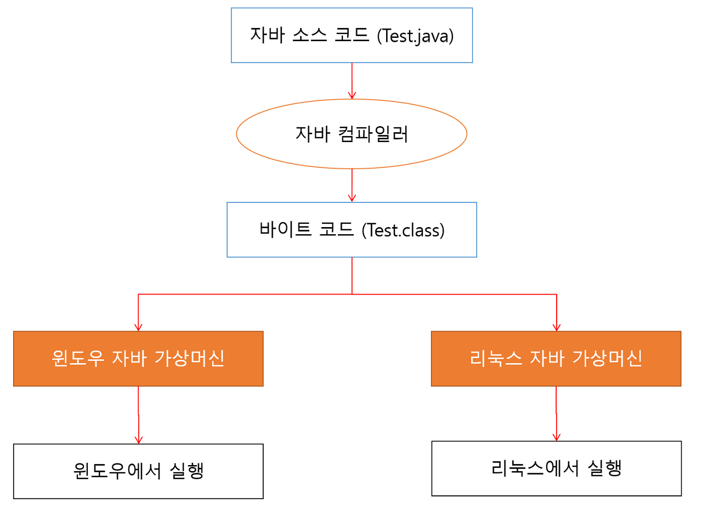

Java 같은 경우 컴파일하면 `.class`라는 바이트 코드 파일이 생성된다. 그러면 JVM이 바이트 코드를 운영체제에 맞는 실행 파일로 해석해준다.

**Java는 플랫폼에 종속적이지 않지만 JVM은 플랫폼에 종속적이다.** <br>
즉, 리눅스의 JVM과 윈도우의 JVM은 서로 다르다.


### 동작 방식 및 구조


`.java` 코드를 작성하고 파워쉘이나 javac에 컴파일 명령을 내리면 `.class `코드가 만들어진다.

이후 이 바이트 코드는 클래스 로더를 통해 JVM Runtime Data Area로 로딩되고 `.class` 바이트 코드를 JVM에 가져다주면 프로그램을 실행할 때 JVM이 그때그때 기계어로 해석한다.

---

### JIT(Just In Time) 컴파일러

`컴파일러` 전체 파일을 스킨해 한 번에 번역

`인터프리터` 한 번에 한 문장씩 번역

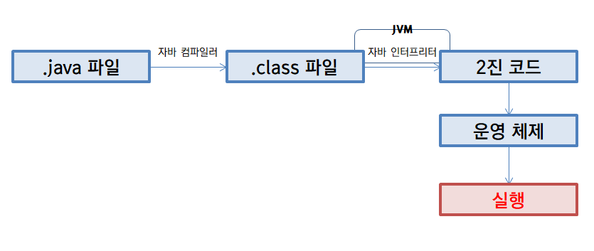


원래 JVM에서는 인터프리터 방식만 사용하다가 성능 이슈의 발생으로 JIT 컴파일러 추가

현재는 컴파일과 인터프리터 방식 병행 사용

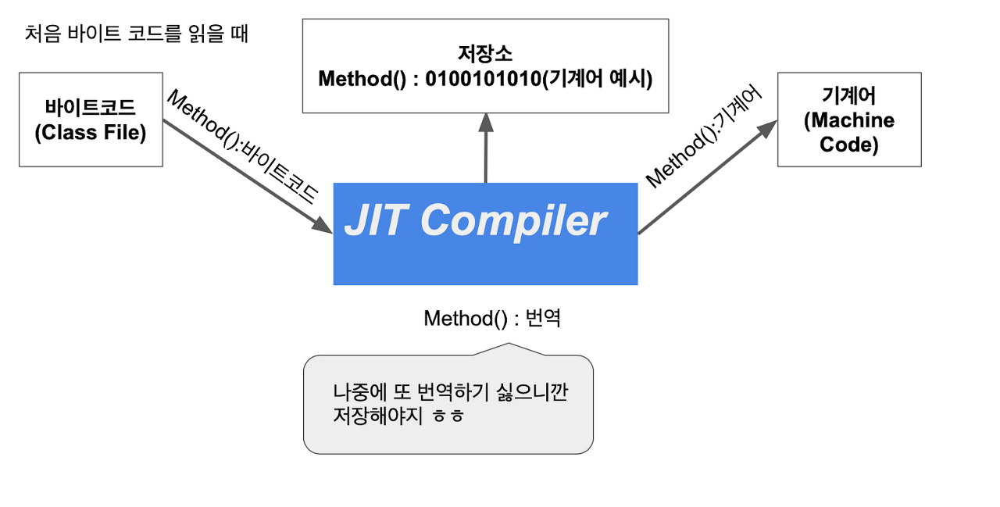 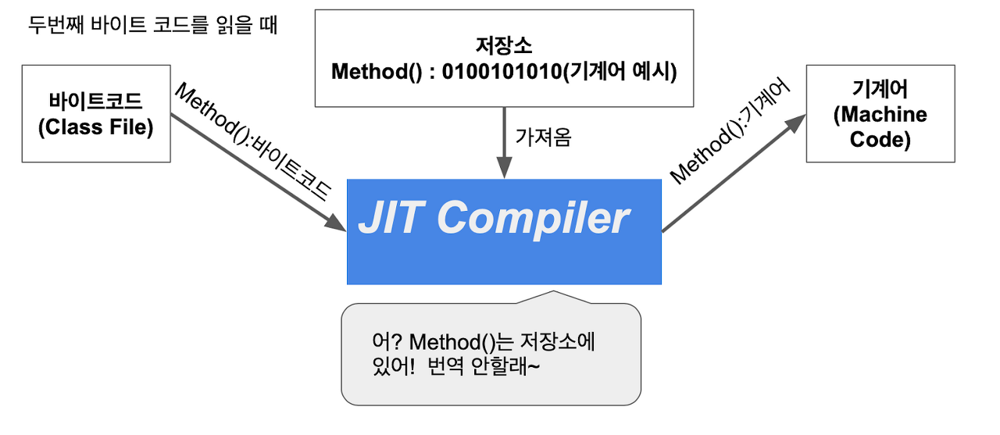

JIT는 실행 시점에 인터프리터 방식으로 기계어 코드를 생성할 때 자주 사용되는 메소드의 경우 컴파일하고 기계어를 캐싱함으로써 해당 메소드가 여러 번 호출될 때 매번 해석하는 것을 방지한다.


JIT 컴파일러는 운영체제에 맞게 바이트 실행 코드로 한 번에 변환해 실행하기 때문에 이전 인터프리터 방식보다 성능이 10-20배 정도 더 뛰어나다.


#### 컴파일 임계치(Compile Threshold)

JIT는 바로 적용되는 게 아니라 JVM이 호출되는 메서드 각각에 대해 호출마다 호출 횟수를 누적해서 그 횟수가 특정 수치를 초과할 때 적용된다.

즉, 얼마나 자주 호출되는지 검사한 후 '이제 컴파일이 필요한 시점이다'라고 판단하는 기준이 있는 것인데, 그게 바로 컴파일 임계치다.

- method entry counter(JVM 내에 있는 메서드가 호출된 횟수)
- back-edge loop counter(메서드가 루프를 빠져나오기까지 돈 횟수)

두 카운터의 합계를 확인하고 메서드가 컴파일될 자격이 있는지 결정한다.

메서드가 컴파일 될 자격이 있다면 해당 메서드는 컴파일되기 위해 큐에서 대기하고, 이후 컴파일 스레드에 의해 컴파일 된다.

---

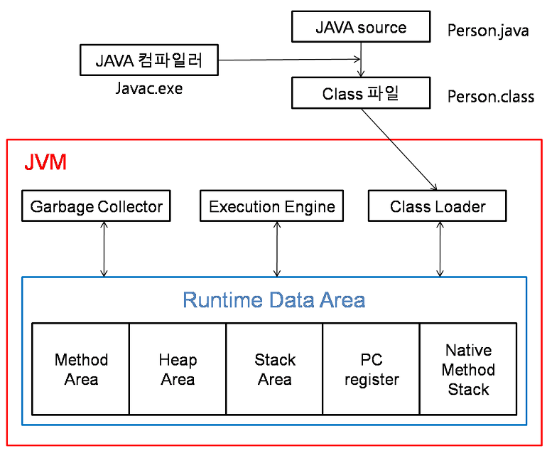


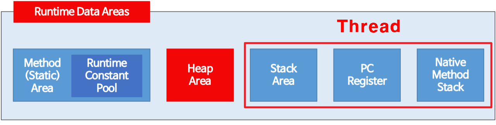

**모든 스레드가 공유해서 사용(GC의 대상)**
- 힙 영역
  - new 키워드로 생성된 객체와 배열이 생성되는 영역
  - 주기적으로 GC가 제거하는 영역

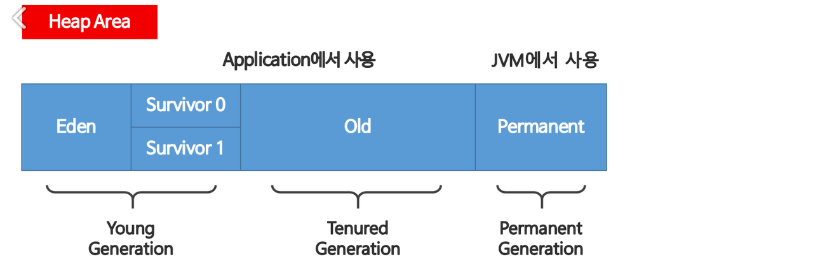

1. Young Generation
  - 자바 객체가 생성되자마자 저장되는, 생긴지 얼마 안 된 객체가 저장되는 공간
  - Heap 영역에 객체가 생성되면 최초로 Eden 영역에 할당된다.
  - 이 영역에 어느 정도 데이터가 쌓이게 되면 참조 정도에 따라 Servivor의 빈 공간으로 이동되거나 회수된다.


2. Tenured Generation
  - young Generation 영역이 차게 되면 또 참조 정도에 따라 Old 영역으로 이동되거나 회수된다.
  - 이 Young Generation과 Tenured Generation에서의 GC를 Minor GC라고 한다.
  - Old 영역에 할당된 메모리가 허용치를 넘게 되면, Old 영역에 있는 모든 객체들을 검사해 참조되지 않는 객체들을 한꺼번에 삭제하는 GC가 실행된다.
    - 시간이 오래 걸리는 작업이고, 이 때 GC를 실행하는 스레드를 제외한 모든 스레드는 작업을 멈추게 된다.
    - 이를 'Stop-the-World'라고 한다.
    - 'Stop-the-World'가 발생하고 Old 영역의 메모리를 회수하는 GC를 Major GC라고 한다.


3. Permanent Generation

- 메서드 영역
  - 클래스 멤버 변수의 이름, 데이터 타입, 접근 제어자 정보와 같은 각종 필드 정보들과 메서드 정보, 데이터 타입 정보, Constant Pool, static 변수, final class 등이 생성되는 영역

**스레드마다 하나씩 생성**
- 스택 영역
  - 지역변수, 파라미터, 리턴 값, 연산에 사용되는 임시 값 등이 생성되는 영역


- PC Register
  - 스레드가 생성될 때마다 생성되는 영역으로 프로그램 카운터, 즉 현재 스레드가 실행되는 부분의 주소와 명령을 저장하고 있는 영역


- Native Method Stack
  - 자바 이외의 언어(C, C++, 어셈블리 등)로 작성된 네이티브 코드를 실행할 때 사용되는 메모리 영역으로 일반적인 C 스택을 사용한다.
  - 보통 C/C++ 등의 코드를 수행하기 위한 스택을 말하며 자바 컴파일러에 의해 변환된 자바 바이트 코드를 읽고 해석하는 역할을 하는 것이 자바 인터프리터(interpreter)다.

<br>


https://coding-factory.tistory.com/828

---

## GC(Garbage Collection)

> 자바의 메모리 관리 방법 중 하나로 JVM의 힙 영역에서 동적으로 할당했던 메모리 영역 중 필요 없게 된
>  메모리 영역을 주기적으로 삭제하는 프로세스
> 
> Mark And Sweep 알고리즘 사용

C나 C++에서는 이러한 가비지 컬렉션이 없어 프로그래머가 수동으로 메모리 할당과 해제를 일일이 해야하는 반면, 
Java는 JVM에 탑재되어 있는 가비지 컬렉터가 메모리 관리를 대행해주기 때문에 개발자 입장에서 메모리 관리, 메모리 누수(Memory Leak) 문제를 완벽히 관리하지 않고 
오로지 개발에만 집중할 수 있다는 장점이 있다.

**단점** </br>
- 개발자는 메모리가 언제 해제되는지 정확하게 알 수 없다.


- 가비지 컬렉션이 동작하는 동안에는 다른 동작을 멈추기 때문에 오버해드가 발생한다.
  - 성능 하락


### GC의 대상 객체

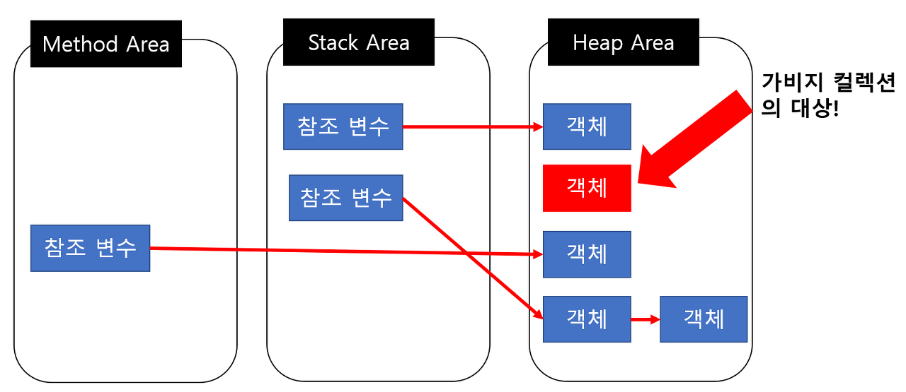


객체들은 실질적으로 Heap 영역에서 생성되고 Method Area나 Stack Area 등 Root Area에서는 
Heap Area에 생성된 객체의 주소만 참조하는 형식으로 구성된다.

하지만 이렇게 생성된 Heap Area의 객체들이 메서드가 끝나는 등의 특정 이벤트들로 인해 Heap Area 객체의 메모리 주소를 가지고 있는 참조 변수가 삭제되는 현상이 발생하면 
위의 그림에서의 빨간색 객체와 같이 Heap 영역 어디에서도 참조하고 있지 않은 객체들이 발생한다.

이러한 객체들을 Unreachable 하다고 하며 주기적으로 GC가 제거해준다.

`Reachable` 객체가 참조되고 있는 상태
`Unreachable` 객체가 참조되고 있는 상태로 GC의 대상이 된다.


**reference** <br>
쉽게 배우는 자바 프로그래밍 <br>
https://coding-factory.tistory.com/827 <br>
https://coding-factory.tistory.com/828 <br>
https://coding-factory.tistory.com/829 <br>
https://jooona.tistory.com/157 <br>
https://catch-me-java.tistory.com/11 <br>
https://jaehoney.tistory.com/173 <br>
https://beststar-1.tistory.com/3

</details>


<details>

<summary>JRE, JDK</summary>

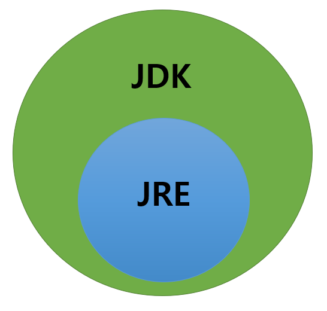

## JRE(Java Runtime Environment)

자바로 만들어진 프로그램을 실행하는 데 필요한 라이브러리들과 각종 API, JVM을 포함하고 있다.

- Java Language
- Tools & Tool APIs
- JRE

---

## JDK(Java Development Kit)

개발자들이 자바로 개발하는 데 필요한 라이브러리들과 javac, javadoc 등의 개발 도구들을 포함하고 있다.

개발하기 위해선 실행도 필요하기 때문에 JRE를 포함하고 있다.

- Deployment
- User Interface ToolKits
- Integration Libraries
- Other Base Libraries
- lang and util Base Libraries
- Java Virtual Machine

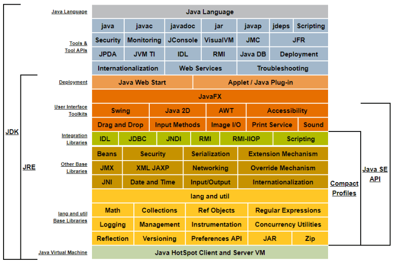

<br>

**reference** <br>
https://coding-factory.tistory.com/826

</details>


<details>

<summary>java 장단점</summary>

## java 장단점

### 장점

- 플랫폼에서 독립적
- 객체지향 언어이므로 유지보수 및 확장성이 좋다.
- 거대한 생태계를 가지고 있어 정보를 구하기 쉽다.
- 꾸준한 발전


### 단점

- C, C++, Rust 등의 언어보다 느린 실행 속도
- 긴 코드 길이
- 정밀한 하드웨어 제어에 부적합
- GC가 언제 어떻게 작동될지 모르기 때문에 실시간 응용 시스템에 부적합
- Oracle사의 Java 유료화

**reference** <br>
https://catch-me-java.tistory.com/11 <br>
https://aboullaite.me/understanding-jit-compiler-just-in-time-compiler/ <br>
https://jaehoney.tistory.com/173 <br>
https://okeybox.tistory.com/131

</details>


<details>

<summary> 접근 제어자의 종류와 특징 </summary>

## 접근제어자(Access Modifier)

- 멤버 또는 클래스에 사용되어 해다아는 멤버 또는 클래스를 외부에서 접근하지 못하도록 제한하는 역할을 함


- 접근제어자는 생략 가능하며 생략했을 때는 자동으로 `default`로 설정된다. 


- 사용될 수 있는 곳: 클래스, 멤버 변수, 메서드, 생성자

`private` 같은 클래스 내에서만 접근 가능
`default` 같은 패키지 내에서만 접근 가능
`protected` 같은 패키지 내에서, 그릭 다른 패키지의 자손 클래스에서 접근 가능
`public` 접근 제한 없음

### 캡슐화(encapsulation)

연관된 목적을 가지는 변수와 함수를 하나의 클래스로 묶어 외부에서 쉽게 접근하지 못하도록 은닉하는 것

캡슐화를 통해 외부에서 내부의 정보에 접근하거나 변경할 수 없도록 직접적인 접근을 막고 객체가 제공하는 필드와 메소드를 통해서만 접근이 가능하다.

- 유지보수나 확장 시 오류의 범위를 최소화할 수 있다.


- 객체 내의 정보 손상과 오용을 방지한다.


- 데이터가 변경되어도 다른 객체에 영향을 주지 않아 독립성이 좋다.


**reference** <br>
https://88240.tistory.com/448 <br>
https://jaynamm.tistory.com/entry/JAVA-자바-캡슐화-Encapsulation

</details>


<details>

<summary>Wrapper class</summary>

## Wrapper class

기본 타입의 데이터를 객체로 표현하는 경우, 기본 타입을 객체로 사용하기 위해 사용하는 클래스

래퍼 클래스로 감싸고 있는 기본 타입 값은 외부에서 변경할 수 없고, 만약 값을 변경하고 싶다면 새로운 포장 객체를 만들어야 한다.

**자바의 자료형**
- 기본 타입(primitive type)
  - char, int, float, double, boolean


- 참조 타입(reference type)
  - class, interface

  
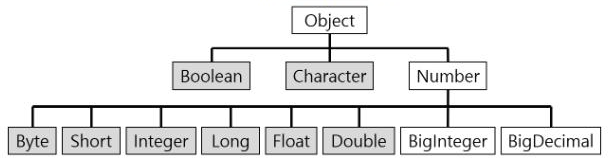


### Boxing, UnBoxing

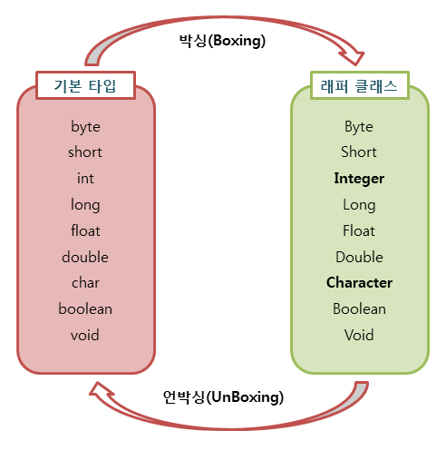

### AutoBoxing, AutoUnBoxing

기본 타입을 직접 박싱, 언박싱하지 않아도 자동으로 일어나는 경우가 있다.

자동 박싱의 포장 클래스 타입에 기본값이 대입될 경우 발생한다. 

```
public class Main {
    public static void main(String[] args) {
    Integer num = 17; //자동 박싱
    int n = num; //자동 언박싱
    }
}
```

int 타입의 값을 Integer 클래스 변수에 대입하면 자동 박싱이 일어나 힙 영역에 Integer 객체가 생성된다.

- 래퍼 객체는 내부 값 비교를 위해 '==' 연산자 사용 불가능
  - 이 연산자는 내부 값이 아닌 래퍼 객체의 참조 주소를 비교하기 때문
  - equals를 사용해야 한다.


- 래퍼 클래스와 기본 자료형과의 비교는 '==' 연산자와 equals 연산 모두 가능
  - 컴파일러가 자동으로 오토박싱과 언박싱을 해주기 때문


- 기본 자료형을 클래스화하여 클래스의 장점을 활용할 수 있다.

**reference** <br>
https://coding-factory.tistory.com/547

</details>


<details>

<summary>인터페이스와 추상 클래스의 차이</summary>

## 추상 클래스

- 객체 간의 공통적 특성을 추출한 클래스
- 일종의 미완성 클래스
- 인스턴스를 생성할 수 없고 오직 상속을 통하여 완성된 자식 클래스로 구현해 인스턴스를 생성할 수 있다.
- 단독으로 사용될 수 없다.
- 오버라이딩이 강제된다.

**사용 이유** <br>
- 객체들의 필드와 메소드 이름을 통일해 소스의 가독성을 높이기 위해서
- 개발의 효율성을 증대시키기 위해서

## 인터페이스

클래스 간에 상호작용하는 규격으로, 사용 방법이 같은 클래스를 만드는 기술


**특징**
- 다중 상속 가능
- 추상 메서드와 상수만 사용 가능
- 생성자 사용 불가
- 메서드 오버라이딩 필수
  - 자식 클래스는 부모 인터페이스의 추상 메서드를 모두 오버라이딩 해야 한다.


**장점**
- 인터페이스만 준수하면 통합에 신경쓰지 않고 다양한 형태로 새로운 클래스를 개발할 수 있다.
- 클래스의 다중 상속을 지원하지 않지만, 인터페이스로 다중 상속 효과를 간접적으로 얻을 수 있다.
- 객체들 간의 네이밍을 통일할 수 있고, 이로 인해 소스의 가독성과 유지보수가 향상된다.
- 확장에는 열려있고 변경에는 닫혀있어 객체 간 결합도(코드 종속성)를 낮춘 유연한 방식의 개발이 가능하다.

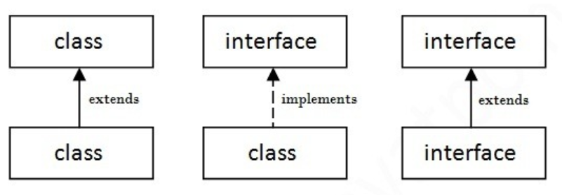

### 인터페이스와 추상 클래스의 차이

| 분류          | 인터페이스                                                          | 추상 클래스              |
|-------------|----------------------------------------------------------------|---------------------|
| 구현 메서드      | 포함 불가(단, 디폴트 메서드와 정적 메서드는 제외)                                  | 포함 가능               |
| 인스턴스 변수     | 포함 불가능                                                         | 포함 가능               |
| 다중 상속       | **가능**                                                         | 불가능                 |
| 디폴트 메서드     | 선언 가능                                                          | 선언 불가능              |
| 생성자와 main() | 선언 불가능                                                         | 선언 가능               |
| 상속에서의 부모    | 인터페이스                                                          | 인터페이스, 추상 클래스       | 
| 접근 범위       | 모든 멤버를 공개                                                      | 추상 메서드를 최소한 자식에게 공개 |
| 사용 가능 변수    | static final                                                   | 제한 없음               |
| 사용 가능 메소드   | abstract method, default method, static method, private method | 제한 없음               |

**공통점** <br>
- 추상 메소드를 가지고 있어야 한다.
- 인스턴스화 할 수 없다.(new 생성자 사용 X)
- 인터페이스 혹은 추상 클래스를 상속받아 구현한 구현체의 인스턴스를 사용해야 한다.
- 인터페이스와 추상 클래스를 구현, 상속한 클래스는 추상 메소드를 반드시 구현해야 한다.

### 추상클래스를 사용하는 경우
자신의 기능들을 하위 클래스로 확장시키는 느낌

- 상속 받을 클래스들이 공통으로 가지는 메소드와 필드가 많아 중복 멤버 통합을 할 때
- 멤버에 public 이외의 접근자 선언이 필요한 경우
- non-static, non-final 필드 선언이 필요한 경우(각 인스턴스에서 상태 변경을 위한 메소드가 필요한 경우)
- 요구사항과 함께 구현 세부 정보의 일부 기능만 지정했을 때
- 하위 클래스가 오버라이드하여 재정의하는 기능들을 공유하기 위한 상속 개념을 사용할 때
- 추상 클래스는 이를 상속할 각 객체의 공통점을 찾아 추상화시켜놓은 것으로, 상속 관계를 타고 올라갔을 때 같은 부모 클래스를 상속하며 부모 클래스가 가진 기능들을 구현해야 할 경우 사용한다.


### 인터페이스를 사용하는 경우
인터페이스에 정의된 메서드를 각 클래스의 목적에 맞게 기능을 구현하는 느낌

- 서로 관련성이 없는 클래스들을 묶어주고 싶을 때
- 다중 상속을 통한 추상화 설계를 해야할 때
- 특정 데이터 타입의 행동을 명시하고 싶은데, 어디서 그 행동이 구현되는지는 신경쓰지 않는 경우
- 클래스와 별도로 구현 객체가 같은 동작을 한다는 것을 보장하기 위해 사용

**reference** <br>
https://coding-factory.tistory.com/867 <br>
https://coding-factory.tistory.com/866 <br>
https://inpa.tistory.com/entry/JAVA-☕-인터페이스-vs-추상클래스-차이점-완벽-이해하기#


</details>


<details>

<summary>final keyword</summary>

## final keyword

불변성을 확보하기 위해 사용하며, 클래스나 변수에 `final`을 붙이면 처음 정의된 상태가 변하지 않음을 보장한다.

**final variables, arguments** <br>
값이 변경되지 않도록 한다.

**final class** <br>
클래스를 상속하지 못하도록 한다.


**final method** <br>
메소드가 오버라이드되지 못하도록 한다.

**주의할 점** <br>
final 변수가 객체를 참조하는 경우, 객체의 상태는 변경될 수 있지만 변수는 같은 객체를 참조한다.

즉, 객체의 상태는 변경 가능하지만 객체를 새로 생성하면 오류가 발생한다.

```
public class Test {
    static final List<String> list = new ArrayList<>();
    static final int num = 3;
    
    public static void main(String[] args) {

	// num = 1; -> 오류 발생
	// list = new ArrayList<>(); -> 오류 발생
        
        
        // final객체인 list의 상태 변경
        list.add("나는 ");
        list.add("final ");
        list.add("list다.");

        for (String string : list) {
            System.out.print(string);
        }
    }
}
```

#### Effective final keyword
Java8에서 추가된 기능으로, `final`이 붙지 않은 변수의 값이 변경되지 않는다면 그 변수를 Effectively final이라고 한다.

final이 붙지 않았지만 컴파일러가 final로 취급하는 것


**reference** <br>
https://sudo-minz.tistory.com/135 <br>
https://programming-beard.tistory.com/165

</details>


<details>

<summary>static vs nonstatic</summary>

## static(정적, 고정된)

static 변수(정적 필드)와 static 메소드(정적 메소드)를 만들 수 있고, 이 둘을 합쳐 정적 멤버(클래스 멤버)라고 한다.

정적 필드와 정적 메소드는 객체(인스턴스)에 소속된 멤버가 아니라 클래스에 고정된 멤버다.

그렇기 때문에 클래스 로더가 클래스를 로딩해서 메소드 메모리 영역에 적재할 때 클래스 별로 관리되며, 클래스의 로딩이 끝나는 즉시 사용할 수 있다.


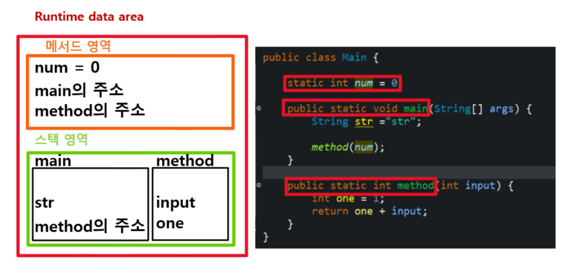

- 메서드 영역: static 멤버, static 메서드들은 메서드가 저장된 메모리의 주소가 저장된다.
- 스택 영역: static 메서드의 멤버 변수와 관련 정보
- static 멤버들로 설정해줌으로써 코드에서 정의한 변수들과 메서드들이 모두 메모리에 올라간다.
- 정적 멤버들은 동일한 클래스의 모든 객체가 공유해 하나의 멤버를 어디서든지 참조할 수 있는 장점을 가지지만 GC의 관리 영역 밖에 존재하기 때문에 프로그램 종료시까지 메모리가 할당된 채로 존재하게 된다.
- 따라서 static을 너무 남발하면 만들고자 하는 시스템 성능에 악영향을 줄 수 있다.


## non-static

- object 멤버
- 인스턴스 변수는 인스턴스가 생성될 때마다 생성되므로 인스턴스마다 각기 다른 값을 가진다.

### 메모리에 적재되는 위치

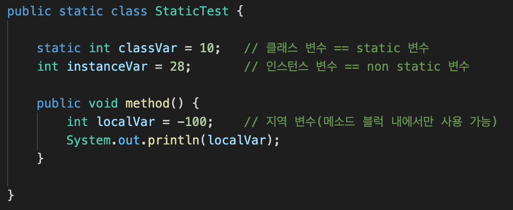


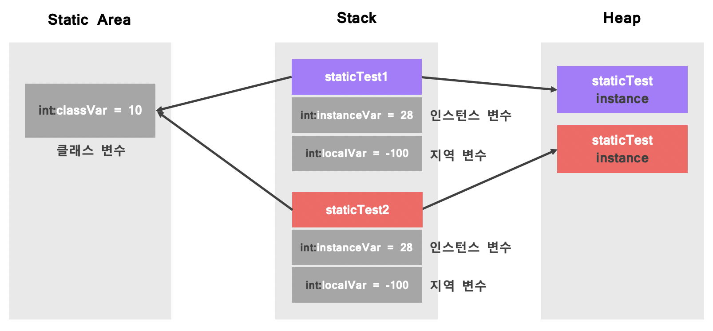

- 인스턴스 변수와 지역 변수는 객체가 생성될 때마다 Stack 영역에 매번 새로 생성되지만 클래스 변수는 Static Area에 한 개만 생성되고 하나의 영역을 공유한다.


**더 자세한 내용** <br>
https://coding-factory.tistory.com/830


**reference** <br>
https://coding-factory.tistory.com/524 <br>
https://lifejusik1004.tistory.com/entry/JAVA-static-과-non-static-의-차이 <br>
https://sujinhope.github.io/2021/03/03/Java-클래스변수,-인스턴스-변수-차이(Static변수와-Non-Static변수).html


</details>

<details>

<summary> main method가 static인 이유 </summary>

## main method가 static인 이유

- static은 java 프로그램이 실행되기 전에 static 함수나 변수를 첫 단계로 메모리에 올려 프로그램을 실행시킨다.
- 프로그램이 종료될 때까지 사라지지 않는다.
- main 함수가 실행되기 위해서는 메모리에 미리 올라가야 한다.
- 메모리에 올라가있지 않으면, 시작점인 main() 메소드를 호출하려고 하는데 메모리에는 main이 없기 때문에 실행을 할 수가 없다.
- 따라서 main 메소드는 누군가 호출하기 전에 미리 메모리에 있어야 하기 때문에 static을 붙인다.


| 변수      | 생성 시기                 | 소멸 시기     | 저장 메모리 | 사용 방법        |
|---------|-----------------------|-----------|--------|--------------|
| 클래스 변수  | 클래스가 메모리에 올라갈 때       | 프로그램이 종료될 떄 | 메소드 영역 | 클래스 이름.변수 이름 |
| 인스턴스 변수 | 인스턴스가 생성될 때           | 인스턴스가 소멸할 떄 | 힙 영역   | 인스턴스 이름.변수이름 |
| 지역 변수   | 블록 내에서 변수의 선언문이 실행될 떄 | 블록을 벗어날 때 | 스택 영역  | 변수 이름        |


**reference** <br>
https://velog.io/@sparkbosing/Java-Main에-static을-사용하는-이유-추상-클래스-vs-인터페이스 <br>

</details>

<details>

<summary>Overriding vs Overloading</summary>

## Overriding

부모 클래스의 메소드 동작 방법을 변경(재정의)하여 우선적으로 사용하는 것

상속 관계에 있는 클래스 간에 같은 이름의 메소드를 정의하는 기술

- 오버라이드하고자 하는 메소드가 상위 클래스에 존재해야 한다.
- 메소드 이름이 같아야 한다.
- 메소드 파라미터 개수, 파라미터의 자료형이 같아야 한다.
- 메소드 리턴형이 같아야 한다.
- 상위 메소드와 동일하거나 내용이 추가되어야 한다.
- 객체지향 언어의 특징인 다형성 중 하나


## Overloading

이름은 같지만 시그니처(파라미터 수, 타입)는 다른 메소드를 중복으로 선언하는 것

같은 메소드라도 매개변수만 다르면 얼마든지 정의하고 사용할 수 있다.

- 메소드 이름이 같아야 한다.
- 리턴형이 같아도 되고 달라도 된다.
- 파라미터 개수가 달라야 한다.
- 파라미터 개수가 같을 경우, 데이터 타입이 달라야 한다.


**reference** <br>
https://brunch.co.kr/@kimkm4726/2

</details>


