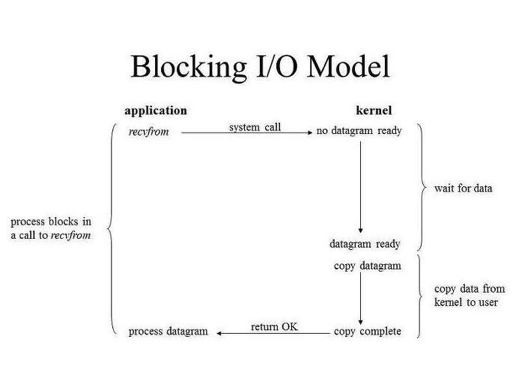
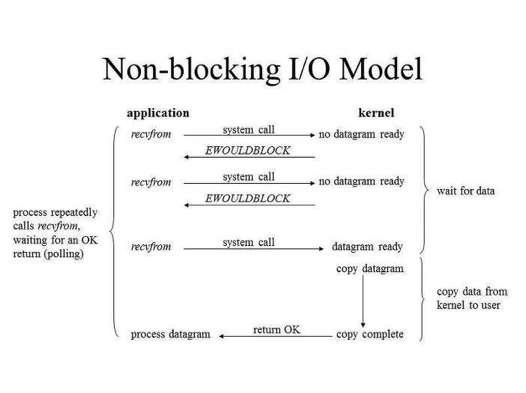

OOP

## OOP(Object Oriented Programing)

핵심은 객체와 클래스

- 데이터는 객체의 속성과 상태를 나타낼 수 있다.
- 행동은 스스로 변화하고 다른 물체와 소통할 수 있는 능력이다.

### 클래스와 객체

객체는 클래스의 인스턴스

각각의 객체는 상태, 행동, 그리고 식별자를 가지고 있다.

객체들은 서로간의 호출을 통해 통신할 수 있으며 이를 `message passing`이라고 한다.

하나의 클래스를 통해 필요로 하는 어플리케이션에 여러 개의 객체를 생성할 수 있다.

각 객체의 식별은 일반적으로 JVM에 의해 유지되며 자바 객체를 만들 때마다 JVM은 각 객체에 대한 해시코드를 만들고 할당하게 된다.

이를 통해 JVM은 모든 개체가 고유하게 식별되도록 한다.

### 생성자

생성자는 반환값이 없는 특수한 메서드

생성자의 이름은 항상 클래스의 이름과 동일하며, 초기 객체 상태를 설정하기 위한 매개 변수를 사용할 수도 있다.

생성자를 작성하지 않는 경우 JVM은 기본 생성자를 할당하며, 이는 매개변수를 허용하지 않기 때문에 매개변수가 필요한 경우에는 개발자가 직접 생성자를 작성해야 한다.

### 4가지 특징

**1. 추상화(Abstraction)**

컨텍스트와 관련이 없는 정보를 숨기거나 관련된 정보만 알 수 있도록 하는 것

- 데이터 추상화
  - 복잡한 데이터 형태를 생성하기 위해 작은 데이터 타입을 사용하는 방법

- 제어 추상화
  - 어떤 클래스의 메소드를 사용하는 사용자에게 해당 메소드의 작동방식과 같은 로직을 숨기기 위해 사용
  - 메소드 내 로직이 변경되더라도 실제 사용자는 변경된 내용과 관계없이 이전과 동일하게 메소드를 사용할 수 있다.
  - 로직이 변경되더라도 사용자에게 영향을 주지 않는다.

**2. 캡슐화(Encapsulation)**

관련이 있는 변수와 함수를 하나의 클래스로 묶고 외부에서 쉽게 접근하지 못하도록 은닉하는 것

객체의 직접적인 접근을 막고, 외부에서 내부의 정보에 직접 접근하거나 변경할 수 없다.

객체가 제공하는 필드와 메서드를 통해서만 접근이 가능하다.

**정보 은닉**

모든 객체지향 언어적 요소를 활용해 객체에 대한 구체적인 정보를 노출시키지 않도록 하는 기법

종류
- 객체의 구체적인 타입 은닉(상위 타입 캐스팅)
- 객체의 필드 및 메소드 은닉(캡슐화)
- 구현 은닉(인터페이스 및 추상 클래스 기반의 구현)

**정보 은닉의 목적**

- 코드가 타입, 메소드, 구현에 의존하는 것을 막음으로써 객체간의 구체적인 결합도를 약화시켜 교체나 변경이 쉽도록 함
- 동일한 타입의 달느 구현 객체들을 교체함으로써 동적 기능 변경 가능
- 연동할 구체적인 구현이 없는 상태에서도 인터페이스만으로 정확한 연동 코드의 생성이 가능하다.

**3. 상속(Inheritance)**

하나의 클래스가 부모 클래스의 속성과 행동을 얻게 되는 방법

코드의 재사용성과 유지보수를 위해 사용

`extends` 키워드를 통해 사용할 수 있으며, 상속되는 클래스를 super 클래스, 새롭게 생성된 클래스를 sub 클래스라고 한다.

sub 클래스는 super 클래스의 non-private 멤버들을 상속받게 되며, 생성자는 멤버가 아니기 때문에 상속되지 않는다.

하지만 sub 클래스에서 super 클래스의 생성자를 호출할 수 있다.

**4. 다형성(polymorphism)**

같은 자료형에 여러가지 객체를 대입해 다양한 결과를 얻어내는 성질

이를 통해 동일한 이름을 가진 여러 형태의 메소드들을 만들 수 있다.

- compile time polymorphism
  - 컴파일러가 필요한 모든 정보를 가지고 있고, 프로그램 컴파일 중에 호출할 방법을 알기 때문에 컴파일 시간에 적절한 메소드를 각각의 객체에 바인딩할 수 있다.
  - 정적 바인딩이나 early binding 이라고도 불린다.
  - 메소드 오버로딩을 통해 사용되며, 이를 통해 메소드의 매개변수의 형태가 달라질 수 있다.

- runtime polymorphism
  - 동적 바인딩이라고 불리며 메소드 오버라이딩과 관련이 있다.
  - 일반적으로 런타임 다형성은 부모 클래스와 자식 클래스가 존재할 때 사용되는데 부모자식 클래스에 존재하는 메소드를 실행시키게 되면 런타임 과정에서 해당 인스턴스에 맞는 메소드를 호출하게 된다.

### 5대 원칙(SOLID 원칙)

- 단일 책임 원칙(SPR, Single Responsibility Principle)
  - 모든 클래스는 각각 하나의 책임만 가져야 한다.
  - 클래스는 그 책임을 완전히 캡슐화해야 한다.

  
- 개방-폐쇄 원칙(OCP, Open Closed Principle)
  - 확장에는 열려있고 수정에는 닫혀있어야 한다.
  - 기존 코드를 변경하지 않으면서 기능을 추가할 수 있도록 설계되어야 한다.

- 리스코프 치환 원칙(LSP, Liskov Substitution Principle)
  - 자식 클래스는 언제나 자신의 부모 클래스를 대체할 수 있다.
  - 즉, 부모 클래스가 들어갈 자리에 자식 클래스를 넣어도 잘 작동해야 한다.
  - 자식 클래스는 부모 클래스의 책임을 무시하거나 재정의하지 않고 확장만 수행해야 한다.

- 인터페이스 분리 원칙(ISP, Interface Segregation Principle)
  - 한 클래스는 자신이 사용하지 않는 인터페이스는 구현하지 말아야 한다.

- 의존 역전 원칙(DIP, Dependency Inversion Principle)
  - 의존 관계를 맺을 때 변화하기 쉬운 것 또는 자주 변화하는 것보다 변하기 어려운 것, 거의 변하지 않는 것에 의존해야 한다.
  - 즉, 구체적인 클래스보다 인터페이스나 추상 클래스와 관계를 맺어야 한다.

**reference**  
https://velog.io/@vincentj2/JAVA-OOP란  
https://sarguments.me/encapsulation-vs-information-hiding/  
https://hckcksrl.medium.com/solid-원칙-182f04d0d2b

Multi-Thread 환경에서의 개발

## Multi-Thread 환경에서의 개발

### Thread

- 프로그램 내에서 실행되는 프로그램 제어 흐름(실행 단위)을 말한다.
- 한 프로그램에 여러 개의 스레드가 존재할 수 있다.
- 프로그램 코드를 한 줄씩 실행하는 것이 스레드의 역할이다. (=실행제어)
- 스레드란 곧 프로그램을 실행하는 주체이다.
- 스레드를 보통 가벼운 프로세스(light-process)라고 표현한다.

### Multi-Thread

- 여러 개의 스레드를 이용하는 프로그램
- 다중 스레드에서 각각의 스레드는 하나의 독립적인 프로세스처럼 작업 수행

#### 멀티 스레드로 구현된 프로그램을 실행하면

- 하나의 프로세서는 한 번에 하나의 스레드밖에 실행시키지 못한다.
- 대신 일정한 간격으로 수행해야 하는 스레드를 전환한다.
- 스레드를 전환할 때는 운영체제의 스케줄러의 기준에 따라 순서가 정해지게 된다.
- 여러 스레드를 번갈아 처리하기 때문에 엄밀히 말하면 한 가지를 처리하지만 동시에 작업하는 듯한 효과를 준다.
- 이와 같은 방식을 시분할 방식이라고 한다.

#### 멀티 스레드 방식을 사용하는 이유(장점)

- 프로세스는 독립적이다. 이 때문에 작업 공간이 독립적이고, 프로세스끼리 자원 및 데이터를 공유하기 어렵다.
  - 프로세스 간에 데이터 전송이 필요한 경우 시간 및 자원 소요가 많다.

- 프로세스 내의 스레드는 서로 독립적이지 않다. 작업 공간을 함께 사용하기 때문에 자원 및 데이터를 공유할 수 있다.
  - 즉, 스레드 간 데이터 전송이 필요한 경우 시간 및 자원 소요가 적다.

- 스레드는 프로세스처럼 작업을 동시에 처리할 수 있는 특징이 있으면서, 프로세스보다 오버헤드가 적다는 장점이 있다.

[more](https://makecodework.tistory.com/entry/Java-스레드Thread-스레드-개념-및-생성하기)

### Field Member

#### Field

클래스에 포함된 변수를 의미한다. 즉, 객체의 속성을 정의하는 공간

**변수**  
- 클래스 변수(class variable)
- 인스턴스 변수(instance variable)
- 지역 변수(local variable)

필드에서 다루는 변수는 클래스 변수와 인스턴스 변수!

----

필드에 변수를 만들어두면 메소드끼리 변수를 주고 받는 데 있어서 참조하기 쉽다.

하지만 객체가 여러 스레드가 접근하는 싱글돈 객체라면 field에서 상태값을 가지고 있으면 안 된다.

모든 변수를 파라미터로 넘겨받고 return 하는 방식으로 코드를 구성해야 한다.

### 동기화(Synchronized)와 비동기화

자바는 `Synchronized` 키워드를 사용해 스레드 간 race condition(경쟁 상태)을 통제한다.

#### 동기화(Synchronized)

한 자원에 대해 동시에 접근하는 것을 제한하는 방식

요청과 그 결과가 동시에 일어나며, 어떤 객체 또는 함수 내부에서 다른 함수를 호출했을 때 이 함수의 결과를 호출한 쪽에서 처리하면 동기

- System Call이 끝날 때까지 다른 스레드의 접근을 막아버리는 것
- 예시) nextLine()에서 입력을 받을 때까지 대기하는 것

#### 비동기화(Asynchronized)

한 자원에 대해 동시 접근 가능

요청과 그 결과가 동시에 일어나지 않으며, 동기와 달리 어떤 객체 또는 함수 내부에서 다른 함수를 호출했을 때 이 함수의 결과를 호출한 쪽에서 처리하지 않으면 비동기(Ex: Ajax)

- System Call이 왔든 말든 상관없이 계속 호출 가능
- Call Back 함수를 통해 결과를 가져온다.

### block / nonblock

#### Blocking

자신의 수행결과가 끝날때까지 제어권을 가지고 있는 것

#### Non-Blocking

자신이 호출되었을 때 제어권을 바로 자신을 호출한 쪽으로 넘기며, 자신을 호출한 쪽에서 다른 일을 할 수 있도록 하는 것

흔히 '비동기로 처리했다'라는 말은 수행하고자 하는 작업이 논블로킹임을 내포함

순차적으로 작업이 처리되어야 한다면 동기 혹은 블로킹 방식을 사용해야 한다.

### Volatile

각 스레드는 메인 메모리로부터 값을 복사해 CPU 캐시에 저장해 작업한다.

CPU가 두 개 이상이라면 멀티 스레드 환경에서 각 스레드는 서로 다른 CPU에서 동작하고 있으며, 이는 각 스레드가 같은 변수에 대해 읽기, 쓰기 동작을 수행할 시 
각자의 CPU 캐시에 메인 메모리의 값과 다른 값을 갖고 있을 수 있게 된다.

하지만 자바에서 어떤 변수에 `volatile` 키워드를 붙이면 해당 변수는 모든 읽기와 쓰기 작업이 CPU 캐시가 아닌 메인 메모리에서 이루어지게 되고, 그럼으로써 해당 변수 값에 대해 가시성을 보장할 수 있게 된다.

사실 이 가시성이란 읽기, 쓰기 작업에 대해서 '동시성 문제를 해결해준다.'는 의미는 아니다.

따라서 반드시 `synchronized` 키워드로 공유 객체에 대한 동기화 처리까지 해주어야 싱글톤을 보장받을 수 있다.

### ThreadLocal

Thread 단위로 로컬 변수를 할당하는 기능

일반 변수의 수명은 특정 코드 블록[ex) method 범위, for 블록 내의 범위] 내에서만 유효하다.

반면 ThreadLocal을 이용하면 thread 영역에 변수를 설정할 수 있기 때문에 특정 스레드가 실행하는 모든 코드에서 그 스레드에 설정된 변수 값을 사용할 수 있게 된다.

**reference**  
https://makecodework.tistory.com/entry/Java-스레드Thread-스레드-개념-및-생성하기  
https://velog.io/@dewgang/자바-Multi-Thread-환경에서의-개발  
https://ittrue.tistory.com/m/118  
https://theheydaze.tistory.com/612  
https://huisam.tistory.com/entry/Synchronized-Asynchronized  
https://kwangkyun-world.tistory.com/entry/동기화Synchronized-vs-비동기화Asynchronized-블로킹blocking과-논블로킹non-blocking
https://velog.io/@naneun/Java-Volatile-키워드란  
https://velog.io/@hsjung2015/JAVA-ThreadLocal에-대하여  

