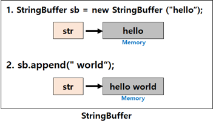

Collection

## Collection

**reference**  
https://crazykim2.tistory.com/557  

Annotation

## Annotation

자바 소스 코드에 추가해 사용할 수 있는 메타 데이터의 일종

보통 `@` 기호를 앞에 붙여서 사용하며 JDK 1.5 버전 이상에서 사용 가능하다.

자바 애노테이션은 클래스 파일에 임베디드되어 컴파일러에 의해 생성된 후 자바 가상머신에 포함되어 작동한다.

**종류**
- 표준(내장) 어노테이션: 자바가 기본적으로 제공해주는 어노테이션
  - `@Override` 오버라이딩을 올바르게 했는지 컴파일러가 체크
  - `@Deprecated` 앞으로 사용하지 않을 것을 권장하는 필드나 메서드에 붙음
  - `@FunctionalInteface` 함수형 인터페이스에 붙이면, 컴파일러가 올바르게 작성했는지 체크
  - `@SuppressWarnings` 컴파일러의 경고 메세지가 나타나지 않게 한다.

- 메타 어노테이션: 어노테이션을 위한 어노테이션
  - `@Target` 어노테이션을 정의할 때, 적용 대상을 지정하는 데 사용
  - `@Retention` 어노테이션이 유지되는 기간을 지정하는 데 사용
  - `@Documented` javadoc으로 작성한 문서에 포함시키려면 해당 어노테이션을 붙인다.
  - `@Inherited` 어노테이션을 자손 클래스에 상속하고자 할 때 붙인다.
  - `@Repeatable` 반복해서 붙일 수 있는 어노테이션을 정의할 때 사용

  
- 사용자 정의 어노테이션: 사용자가 직접 정의하는 어노테이션

**reference**  
https://velog.io/@jkijki12/annotation  

Genereic

## Generic

데이터 형식에 의존하지 않고 하나의 값이 여러 다른 데이터 타입들을 가질 수 있도록 하는 방법으로, 
타입을 클래스 내부에서 지정하지 않고 외부에서 사용자에 의해 지정되도록 한다.

**장점**  
- 제네릭을 사용하면 잘못된 타입이 들어올 수 있는 것을 컴파일 단계에서 방지할 수 있다.
- 클래스 외부에서 타입을 지정해주기 때문에 따로 타입을 체크하고 변환해줄 필요가 없다.(=관리가 편하다.)
- 비슷한 기능을 지원하는 경우 코드의 재사용성이 높아진다.

| 타입  | 설명      |
|-----|---------|
| <T> | Type    |
| <E> | Element |
| <K> | Key     |
| <V> | Value   |
| <N> | Number  |

### c++의 템플릿과의 차이

#### Java

타입 제거라는 개념에 근거

소스코드를 JVM이 인식하는 바이트 코드로 변환할 때 인자로 주어진 타입을 제거하는 기술

#### C++

컴파일러는 인자로 주어진 각각의 타입에 대해 별도의 템플릿 코드를 작성한다.

- C++ Template은 int와 같은 기본 타입을 인자로 넘길 수 있다.
- Java Generic에서는 모든 타입은 Object를 상속해야 하며 따라서 int 대신 Integer를 사용해야 한다.

- Java의 경우 Generic 타입 인자를 특정한 타입이 되도록 제한할 수 있다. (한정적 형인자)

- C++ Template은 인자로 주어진 타입으로부터 객체를 만들어낼 수 있다. 자바에서는 불가능하다.

- Java에서 Generic type 인자는 static 메서드나 변수를 선언하는 데 사용될 수 없다.
- C++에서는 템플릿 타입 인자를 static 메서드나 변수를 사용하는 데 사용할 수 있다.

- Java에서 제네릭으로 만든 모든 객체는 제네릭 타입 인자가 무엇이냐에 관계 없이 전부 동등한 타입이다. 실행 시간에 타입 인자 정보는 삭제된다.
- C++에서 다른 템플릿 타입 인자를 사용해 만든 객체는 서로 다른 타입 객체이다.

**reference**  
https://st-lab.tistory.com/153  
https://chchang.tistory.com/entry/C%EC%9D%98-template%EA%B3%BC-Java-generic-method-%EC%99%80%EC%9D%98-%EA%B3%B5%ED%86%B5%EC%A0%90%EA%B3%BC-%EC%B0%A8%EC%9D%B4%EC%A0%90

직렬화와 역직렬화

## 직렬화(Serialization)

객체를 연속된 Byte나 String으로 변환하는 과정

즉, 객체를 파일의 형태 등으로 저장하거나, 통신하기 쉬운 포맷으로 변환하는 과정을 의미한다.

일반적으로 자바에서 직렬화라고 이야기하는 것은 객체를 Byte로 변환하는 과정을 의미한다.

하지만 Byte 외에도 표 형태로 직렬화할 때는 CSV, 구조적인 형태로 직렬화할 때는 JSON, XML 등 다양한 포맷으로 직렬화할 수 있다.

## 역직렬화(Deserialization)

직렬화된 파일 등을 역으로 직렬화하여 다시 객체의 형태로 만드는 것으로 저장된 파일을 읽거나 전송된 스트림 데이터를 읽어 원래 객체의 형태로 복원한다.

**reference**  
https://hudi.blog/serialization/  

CAll by Refence와 Call by Value의 차이

## Call by Value(값에 의한 호출)

인자로 받은 값을 복사하여 처리

**장점**
- 복사하여 처리하기 때문에 안전하다.
- 원래의 값이 보존된다.

**단점**
- 복사를 하기 때문에 메모리 사용량이 늘어난다.

## Call by reference(참조에 의한 호출)

인자로 받은 값의 주소를 참조해 직접 값에 영향을 준다.

**장점**
- 복사하지 않고 직접 참조를 하기 때문에 빠르다.

**단점**
- 원래 값이 영향을 받는다.

자바는 포인터가 없기 때문에 기본적인 매개변수는 Call by Value지만 배열과 클래스는 참조 변수로 Call by Reference로 작동한다.

**reference**  
https://sudo-minz.tistory.com/91

String, StringBuilder, StringBuffer

연산이 많지 않을 땐 어떤 클래스를 사용해도 이슈가 발생할 가능성은 거의 없다.

그러나 여산 횟수가 많아지거나 멀티쓰레드, Race condition 등의 상황이 자주 발생한다면 적절한 클래스를 사용해줘야 한다.

## String

불변의 속성을 갖는다.

- 변하지 않는 문자열을 자주 읽어들이는 경우 String을 사용하면 좋은 성능을 기대할 수 있다.
- 그러나 추가, 수정, 삭제가 빈번하게 일어나는 알고리즘에 String 클래스를 사용하면 힙 메모리에 많은 garbage가 생성되어 힙 메모리 부족으로 어플리케이션 성능에 악영향을 미치게 된다.

## StringBuffer / StringBuilder

가변성을 갖는다.

- `.append()`나 `.delete()` 등의 API를 사용해 동일 객채 내에서 문자열을 변경하는 것이 가능하다.
- 문자열의 추가, 수정, 삭제가 빈번하게 일어나는 경우 사용하는 것이 좋다.

### StringBuffer vs StringBuilder

가장 큰 차이점은 동기화의 유무로, StringBuffer는 동기화 키워드를 지원해 멀티쓰레드 환경에서 안전하다는 점(thread-safe이다.

참고로 String도 불변성을 가지기 때문에 멀티쓰레드 환경에서의 안정성을 가지고 있다.

반면 StringBuilder는 동기화를 지원하지 않기 때문에 멀티쓰레드 환경에서 사용하는 것은 적합하지 않지만 동기화를 고려하지 않는 만큼 
단일쓰레드에서의 성능은 StringBuffer보다 뛰어나다.

checked exception, unchecked exception

- 체크 예외(checked exception)
- 에러(error)
- 언체크 예외(unchecked exception)

## Error

시스템에 비정상적인 상황이 발생했을 경우

- 메모리 부족(OutOfMemoryError)
- Stack Over Flow Error

## Exception

프로그램 실행 중에 개발자의 실수로 예기치 않은 상황이 발생했을 때

- 배열 범위 벗어남(ArrayIndexOutOfBoundsException)
- null값 참조(NullPointerException)
- 존재하지 않는 파일 입력(FileNotFoundException)

### Checked Exception

RuntimeException의 하위 클래스가 아니면서 Exception 클래스의 하위 클래스로, 반드시 에러 처리를 해야 하는 특징(try/catch or throw)을 갖고 있다.

- FileNotFoundException
- ClassNotFoundException

### Unchecked Exception

RuntimeException의 하위 클래스로, 에러 처리를 강제하지 않는다.

말 그대로 실행 중에 발생할 수 있는 예외

- ArrayIndexOutOfBoundsException
- NullPointerException

### Checked Exception과 Unchecked Exception Rollback 여부

- Checked Exception: Rollback 되지 않고 트랜잭션이 commit까지 완료됨
- Unchecked Exception: Rollback 된다.

**reference**  
https://devlog-wjdrbs96.tistory.com/351  

==와 equals()의 차이

## == 와 equals()의 차이

java에서 int와 boolean처럼 일반적인 데이터 타입의 비교는 `==`를 이용해 비교한다.

하지만 String처럼 클래스의 값을 비교할 때는 `equals()`라는 메소드를 이용해 비교한다.

== 연산자는 비교하고자 하는 두 개의 대상의 주소값을 비교
String class의 equals 메소드는 비교하고자 하는 두 개의 값 자체를 비교

기본 타입의 int, char형은 call by value 형태로 기본적으로 대상에 주소값을 가지지 않는 형태로 사용된다.

하지만 String은 클래스이므로 call by reference 형태로 생성 시 주소값이 부여되기 때문에 같은 값을 부여하더라도 서로간에 주소값이 다르다.

**reference**  
https://coding-factory.tistory.com/536  

 리플렉션 

## 리플렉션(Reflection)

구체적인 클래스 타입을 알지 못해도 그 클래스의 메소드, 타입, 변수들에 접근할 수 있도록 해주는 자바 API

컴파일 시간이 아닌 실행 시간에 동적으로 특정 클래스의 정보를 추출할 수 있는 프로그래밍 기법

#### 언제 사용될까

- 동적으로 클래스를 사용해야 할 떄
- 작성 시점에는 어떤 클래스를 사용해야할지 모르지만 런타임 시점에서 클래스를 가져와서 실행해야 하는 경우 필요하다.
- 대표적으로는 Spring framework의 annotation 같은 기능들이 리플렉션을 이용해 프로그램 실행 도중 동적으로 클래스의 정보를 가져와서 사용한다.

#### 가져올 수 있는 정보

- Class
- Constructor
- Method
- Field

**reference**  
https://velog.io/@yeon/Reflection이란  
https://kdg-is.tistory.com/entry/JAVA-리플렉션-Reflection이란  

Stream

## Stream

Java 8부터 지원되기 시작한 기능으로, 컬렉션에 저장되어있는 element들을 하나씩 순회하면서 처리할 수 있는 코드패턴이다.

Java 6 이전까지는 컬렉션의 element들을 순회하기 위해 Iterator 객체를 이용했다.

람다식과 함께 사용되어 컬렉션에 들어있는 데이터에 대한 처리를 매우 간결한 표현식으로 작성할 수 있다.

또한, 내부 반복자를 사용하기 때문에 병렬처리가 쉽다는 장점이 있다.

**reference**  
https://hbase.tistory.com/171

Lambda

## Lambda

익명 함수(Anonymous functions)를 지칭하는 용어로 함수를 보다 단순하게 표현하는 방법이다.

Java 8부터 적용가능하며, 병렬 처리, 이벤트 처리 등 함수적 프로그래밍에서 유용하게 사용된다.

### 사용 조건
- 함수적 인터페이스만 사용 가능

`함수적 인터페이스` 인터페이스가 단 한 개의 추상 메소드를 정의하고 있는 인터페이스

즉, 두 개의 추상 메소드를 가지고 있다면 람다식을 사용할 수 없다.

**장점**  
- 기호 및 약속된 표현을 쓰기 때문에 코드가 간결해진다.
- 필터링 및 매핑 시 집계결과를 쉽게 가져올 수 있다.(내장된 메서드 사용 가능)
- 병렬 처리 가능

**단점**  
- 람다를 사용하면서 만드는 익명함수는 재사용이 불가능하다.
- 람다식 호출과 디버깅이 까다롭다.
- 재귀에 부적합
- 불필요하게 많이 사용하게 되면 오히려 가독성을 떨어뜨릴 수 있다.

**reference**  
https://khj93.tistory.com/entry/JAVA-람다식Rambda란-무엇이고-사용법  
https://velog.io/@tsi0521/java-Lambda  
https://makecodework.tistory.com/entry/Java-람다식Lambda-익히기  
https://velog.io/@gillog/Java-Lambda-Expressions람다식

