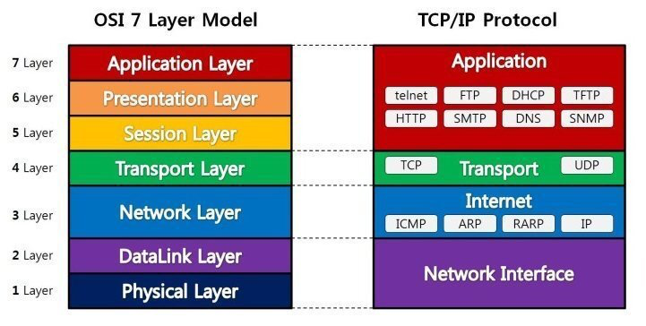
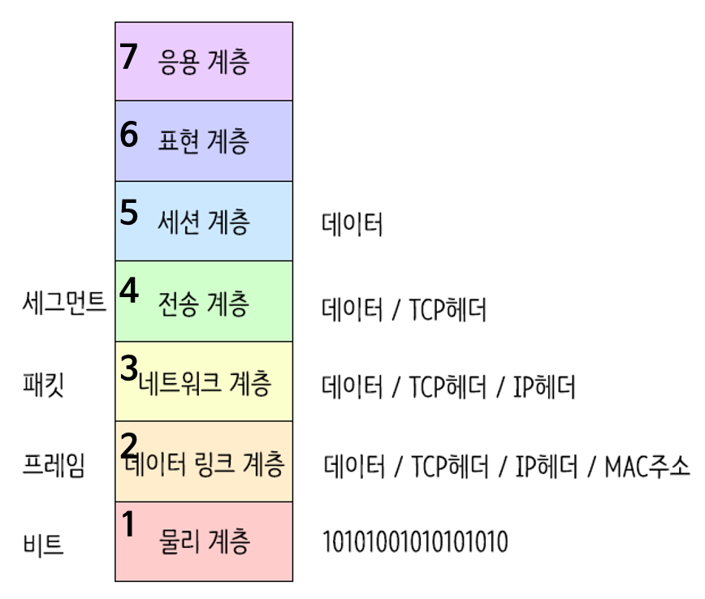
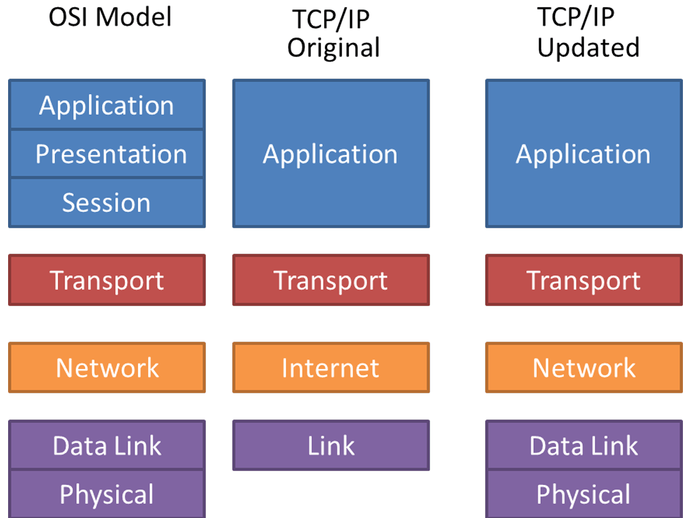
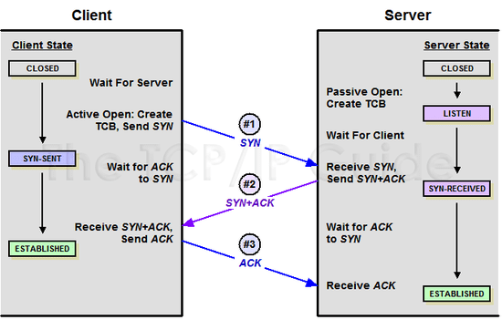
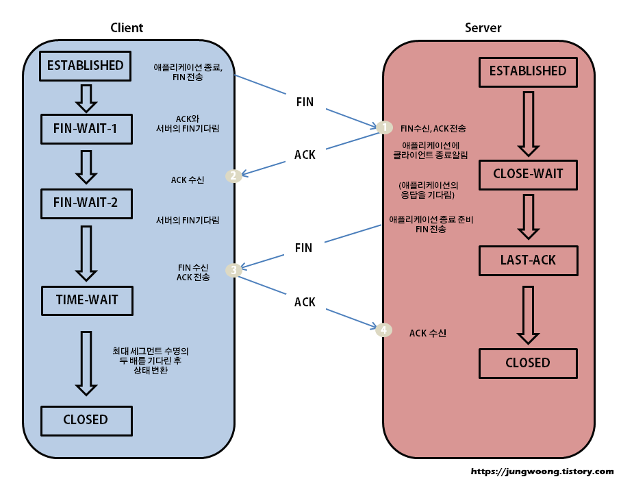
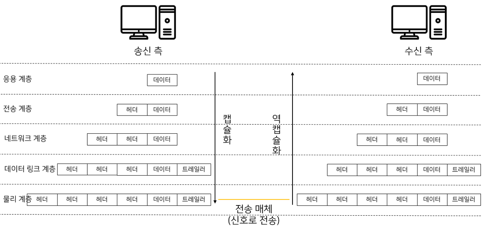

OSI 7계층

## OSI 7계층

### 1 Layer - Physical Layer

- 주로 전기적, 기계적, 기능적인 특성을 이용해 케이블로 데이터를 전송하는 물리적 장비
- 사용되는 통신 단위는 비트(1, 0)이며 데이터를 전기적인 신호로 변환해서 전달하기만 할 뿐 데이터의 내용, 에러에는 신경쓰지 않는다.
- 장비: 통신 케이블, 리피터, 허브 등

### 2 Layer - DataLink Layer

- 물리 계층을 통해 송수신되는 정보의 오류와 흐름을 관리해 안전한 통신의 흐름을 관리
- 프레임에 물리적 주소(MAC address)를 부여하고 에러 검출, 재전송, 흐름 제어를 수행
- 전송 단위: 프레임
- 장비: 브리지, 스위치

### 3 Layer - Network Layer

- 데이터를 목적지까지 가장 안전하고 빠르게 전달하는 기능(라우팅) 수행
- 라우터를 통해 경로를 선택하고 **주소(IP)를 정하고 경로(Route)에 따라 패킷 전달**
- 역할: 라우팅, 흐름 제어, 세그멘테이션(segmentation/desegmentation), 오류 제어, 인터네트워킹(internetworking)
- 서브네트의 최상위 계층으로 경로를 설정하고, 청구 정보를 관리한다.
- 개방형 시스템들 사이에서 네트워크 연결을 설정, 유지, 해제하는 기능을 붕하고 전송 계층 사이에 네트워크 서비스 데이터 유닛(NSDU, Network Service Data Unit)을 교환하는 기능을 제공한다.
- 전송 단위: 패킷(Packet)
- 장비: 라우터

### 4 Layer - Transport Layer

- 통신을 활성화하기 위한 계층

- 보통 TCP 프로토콜을 이용하며, 포트를 열어서 응용프로그램들이 전송을 할 수 있도록 한다.

- 단대단 오류 제어 및 흐름제어로 여기까지 물리적인 계층에 속한다. (TCP/UDP 프로토콜 사용)

- 특정 연결의 유효성을 제어하고, 일부 프로토콜은 상태 개념(stateful)이 있으며 연결 기반(connection oriented)이다.
  - 즉, 패킷들의 전송이 유효한지 확인하고 전송 실패한 패킷들을 다시 전송한다는 것을 뜻한다.

- 종단간(end-to-end) 통신을 다루는 최하위 계층으로 종단간 신뢰성 있고 효율적인 데이터를 전송한다.

- 오류검출 및 복구, 흐름제어, 중복검사 수행

- 패킷 생성(Assembly/Sequencing/Deassembly/Error detection/Request repeat/Flow control) 및 전송

- port 번호, 전송 방식(TCP/UDP) 결정 -> TCP 헤더 붙는다.

### 5 Layer - Session Layer

- 데이터가 통신하기 위한 논리적인 연결
- 기능: 세션 설정, 유지, 종료, 전송 중단시 복구
- 양 끝단의 응용 프로세스가 통신하기 위한 방법 제공
- 동시 송수신 방식(duplex), 반이중 방식(half-duplex), 전이중 방식(Full Duplex)의 통신과 함께 체크 포인팅과 유휴, 종료, 다시 시작 과정 등 수행
- TCP/IP 세션 체결, 포트번호를 기반으로 통신 세션 구성

### 6 Layer - Presentation Layer

- 데이터 표현이 상이한 응용 프로세스의 독립성을 제공하고 암호화한다.
- 코드 간의 번역을 담당해 사용자 시스템에서 데이터의 형식상 차이를 다루는 부담을 응용 계층으로부터 덜어준다.
- 전송하는 데이터의 표현 방식 결정(데이터변환, 압축, 암호화 등)
- 파일 인코딩, 명령어 포장, 압축, 암호화

### 7 Layer - Application Layer

- 최종 목적지로, 응용 프로세스와 직접 관계하여 일반적인 응용 서비스 수행(explore, chrome 등)
- HTTP, FTP, STMP, POP3, IMAP, Telnet 등과 같은 프로토콜이 있다.

**reference**  
https://shlee0882.tistory.com/110  
https://www.youtube.com/watch?v=1pfTxp25MA8  
https://lxxyeon.tistory.com/155

TCP/IP

## TCP/IP

> 인터넷 프로토콜 스위트(Internet Protocol Suite)는 인터넷에서 컴퓨터들이 서로 정보를 주고받는 데 쓰이는 통신규약의 모음이다.
> 
> 이 중 TCP와 IP가 가장 많이 사용되기 때문에 TCP/IP 프로토콜이라고도 불린다.

현재 수많은 프로그램들이 인터넷으로 통신하는 데 있어 기반이 되는 프로토콜로, 대다수 프로그램들은 TCP와 IP로 통신하고 있다.

이를 이용해서 컴퓨터를 연결하는 체계를 이더넷(Ethernet)이라고 부른다.

### 1계층 - 물리 계층

- 상대 컴퓨터와 데이터를 주고 받기 위해 물리적인 전기 신호로 데이터를 전송하는 계층
- 아날로그 신호로 통신, 하드웨어적으로 서킷에 모듈로 존재(PHY칩)

### 2계층 - 데이터 링크 계층

- 같은 네트워크에 있는 여러 대의 컴퓨터들이 데이터를 주고 받기 위해서 필요한 모듈
- 라우터(공유기) 안에 속한 로컬 상의 컴퓨터들을 구분하기 위해 사용
- 하드웨어적으로 랜카드가 존재하며 mac 주소 사용

### 3계층 - 네트워크 계층

- 실질적인 IP 주소 사용
- 수많은 네트워크 계층으로 이루어진 인터넷 망에서 목적지까지 데이터를 전송하기 위해
  1. IP 주소를 이용해 가장 가까운 목적지를 찾는다.(라우팅)
  2. 자신 다음의 인접 라우터에게 데이터를 넘겨주는 역할(포워딩)을 한다.
- 운영체제 커널에서 s/w로 구현

### 4계층 - 전송 계층

- TCP/UDP 헤더 삽입(세그먼트화)
- 포트 번호 설정
- 포트 번호를 사용해 최종 도착지인 프로세스까지 데이터를 도달하게 해주는 계층

### 5계층 - 응용 계층

- 보내는 데이터의 속성 정의
- 이 데이터가 무슨 종류(확장자)인지 판별하기 위해 데이터 타입(이미지 파일, 사운드 파일, 텍스트 파일) 등으로 구분시켜 준다.
- 주로 "dataType:binary" 등으로 헤더를 붙여 보냄

**reference**  
https://oizys.tistory.com/76  

TCP UDP

## TCP

- 신뢰성(Reliable)
    - 패킷 손실, 중복, 순서바뀜 등이 없도록 보장

- 연결지향적(Connection-oriented)
    - 느슨한 연결(Loosely Connected)을 가지므로 강한 연결을 의미하는 가상회선이라는 표현보다는 연결지향적이라는 표현 사용
    - 연결 관리를 위한 연결설정 및 연결해제 필요(TCP 연결 설정, 연결 종료)
    - 양단간 어플리케이션/프로세스는 TCP가 제공하는 연결성 회선을 통해 서로 통신

---

## UDP

가상회선을 굳이 확립할 필요가 없고 유연하며 효율적 응용의 데이터 전송에 사용

- 비연결성, 비신뢰성, 순서화되지 않은 Datagram 서비스 제공

- 실시간 응용 및 멀티캐스팅 가능
    - 빠른 요청과 응답이 필요한 실시간 응용에 적합
    - 여러 다수 지점에 전송 가능(1대다)

- 단순한 헤더
    - TCP처럼 16비트의 포트 번호를 사용하나 헤더는 고정 크기의 8바이트만 사용(TCP는 20바이트)
    - 즉, 헤더 처리에 많은 시간과 노력을 요하지 않음

---

## TCP - 3 way handshake, 4 way handshake

### 3 way handshake

- 연결하고자 하는 두 장치 간의 논리적 접속을 성립하기 위해 사용하는 연결 확인 방식으로, 3번의 확인 과정을 거친다고 해서 3 way handshake라고 부른다.

- SYN(Synchronize Sequence Numbers)
  - 연결 확인을 위해 보내는 무작위의 숫자값

- ACK(Acknowledgements)
  - Client / Server로부터 받은 SYN에 1을 더해 SYN을 잘 받았다는 ACK를 돌려보낸다.

- ISN(Initial Sequence Numbers)
  - Client와 Server가 각각 처음으로 생성한 SYN

### 4 way handshake

- 3 way handshake와 반대로 가상 회선 연결을 해제할 때 주고 받는 확인 작업이다.
- 이 역시 4번의 확인과정을 거친다고 해서 4 way handshake라고 부른다.

- FIN(Finish): TCP 연결을 종료하겠다는 메시지

---

## TCP의 흐름 제어, 혼잡 제어

reliable network를 보장한다는 것은 4가지 문제점 존재
1. 손실: packet이 손실될 수 있는 문제
2. 순서 바뀜: packet의 순서가 바뀌는 문제
3. Congestion: network가 혼잡한 문제
4. Overload: receiver가 overload 되는 문제

### 흐름제어(Flow Control)

- 송신 측과 수신 측의 데이터 처리 속도 차이를 해결하기 위한 기법
- Flow Control은 receiver가 패킷을 지나치게 많이 받지 않도록 조절하는 것
- 기본 개념은 receiver가 sender에게 현재 자신의 상태를 feedback 한다는 점

수신 측이 송신 측보다 데이터 처리 속도가 빠르면 문제 없지만, 송신 측의 속도가 빠를 경우 문제가 생긴다.

수신 측에서 제한한 저장 용량을 초과한 이후에 도착한 데이터는 손실될 수 있으며, 만약 손실된다면 불필요한 응답과 데이터 전송이 송수신측 간에 발생한다.

이러한 위험을 줄이기 위해 송신 측의 데이터를 수신 측에 따라 조절해야 한다.

#### 해결 방법

- Stop and Wait
  - 매번 전송한 패킷에 대해 확인 응답을 받아야만 그 다음 패킷을 전송하는 방법

- Sliding Window(Go Back N ARQ)
  - 수신 측에서 설정한 윈도우 크기만큼 송신 측에서 확인 응답 없이 세그먼트를 전송할 수 있게 해 데이터 흐름을 동적으로 조절하는 제어기법
  - 목적: 전송은 됐지만 ack를 받지 못한 byte의 숫자를 파악하기 위해 사용하는 프로토콜
  - 동적 방식: 먼저 윈도우에 포함되는 모든 패킷을 전송하고, 그 패킷들의 전달이 확인되는대로 이 윈도우를 옆으로 옮김으로써 그 다음 패킷들을 전송

LastbyteSent - LastByteAcked <= ReceivedWindowAdvertised

(마지막에 보내진 바이트 - 마지막에 확인된 바이트 <= 남아있는 공간) == (현재 공중에 떠있는 패킷 수 <= sliding window)

- Window
  - TCP/IP를 사용하는 모든 호스트들은 송신하기 위한 것과 수신하기 위한 2개의 Window를 가지고 있다.
  - 호스트들은 실제 데이터를 보내기 전에 '3 way handshaking'을 통해 수신 호스트의 receive window size에 자신의 send window size를 맞추게 된다.

### 혼잡 제어(Congestion Control)

- 송신 측의 데이터 전달과 네트워크 데이터 처리 속도 차이를 해결하기 위한 기법

- 송신 측의 데이터는 지역망이나 인터넷으로 연결된 대형 네트워크를 통해 전달된다.
- 만약 한 라우터에 데이터가 몰릴 경우, 자신에게 온 데이터를 모두 처리할 수 없게 된다.
- 이런 경우 호스트들은 재전송을 하게 되고, 결국 혼잡만 가중시켜 오버플로우나 데이터 손실을 발생시키게 된다.
- 따라서 이러한 네트워크의 혼잡을 피하기 위해 송신 측에서 보내는 데이터의 전송 속도를 강제로 줄이게 되는데, 이를 혼잡 제어라고 한다.

- 또한 네트워크 내에 패킷의 수가 과도하게 증가하는 현상을 혼잡이라 하며, 혼잡 현상을 방지하거나 제거하는 기능을 혼잡 제어라고 한다.

- 흐름 제어가 송신 측과 수신 측 사이의 전송 속도를 다루는 데 반해, 혼잡 제어는 호스트와 라우터를 포함한 보다 넓은 관점에서 전송 문제를 다루게 된다.

#### 해결 방법

- AIMD(Additive Increase / Multiplicative Decrease)
  - 처음에 패킷을 하나씩 보내고, 이것이 문제 없이 도착하면 window 크기(단위 시간 내에 보내는 패킷의 수)를 1씩 증가시켜가며 전송하는 방법
  - 패킷 전송에 실패하거나 일정 시간을 넘으면 패킷의 보내는 속도를 절반으로 줄인다.
  - 공평한 방식으로, 여러 호스트가 한 네트워크를 공유하고 있으면 나중에 진입하는 쪽이 처음에는 불리하지만 ,시간이 흐르면 평행 상태로 수렴하게 되는 특징이 있다.
  - 문제점은 초기에 네트워크의 높은 대역폭을 사용하지 못해 오랜 시간이 걸리게 되고, 네트워크가 혼잡해지는 상황을 미리 감지하지 못한다.
  - 즉, 네트워크가 혼잡해지고 나서야 대역폭을 줄이는 방식이다.

- Slow Start
  - AIMD 방식이 네트워크 수용량 주변에서는 효율적으로 작동하지만, 처음에 전송 속도를 올리는 데 시간이 오래 걸리는 단점이 존재했다.
  - Slow Start 방식은 AIMD와 마찬가지로 패킷을 하나씩 보내면서 시작하고, 패킷이 문제없이 도착하면 각각의 ACK 패킷마다 window size를 1씩 늘려준다.
  - 전송 속도는 AIMD에 반해 지수 함수 꼴로 증가한다. 대신 혼잡 현상이 발생하면 window size를 1로 떨어뜨리게 된다.
  - 처음에는 네트워크 수용량을 예상할 수 있는 정보가 없지만, 한 번 혼잡 현상이 발생하고 나면 네트워크 수용량을 어느 정도 예상할 수 있다.
  - 그러므로 혼잡 현상이 발생했던 window size의 절반까지는 이전처럼 지수 함수 꼴로 창 크기를 증가시키고 그 이후부터는 완만하게 1씩 증가시킨다.

- Fast Retransmit(빠른 재전송)
    - 빠른 재전송은 TCP의 혼잡 조절에 추가된 정책이다.
    - 패킷을 받는 쪽에서 먼저 도착해야 할 패킷이 도착하지 않고 다음 패킷이 도착한 경우에도 ACK 패킷을 보내게 된다.
    - 단, 순서대로 잘 도착한 마지막 패킷의 다음 순번을 ACK 패킷에 실어 보내게 되므로, 중간에 하나가 손실되게 되면 송신 측에서는 순번이 중복된 ACK 패킷을 받게 된다.
    - 이것을 감지하는 순간 문제가 되는 순번의 패킷을 재전송해줄 수 있다.
    - 주옥된 순번의 패킷을 3개 받으면 재전송을 하게 된다. 약간 혼잡한 상황이 일어난 것이므로 혼잡을 감지하고 window size를 줄이게 된다.

- Fast Recovery(빠른 회복)
  - 혼잡한 상태가 되면 window size를 1로 줄이고 반으로 줄여 선형증가시키는 방법이다.
  - 이 정책까지 적용하면 혼잡 상황을 한 번 겪고 나서부터는 순수한 AIMD 방식으로 동작하게 된다.

**reference**  
https://seongonion.tistory.com/74  
https://gyoogle.dev/blog/computer-science/network/흐름제어%20&%20혼잡제어.html

데이터 캡슐화

## 데이터 캡슐화

데이터 전송 시 캡슐화(Encapsulation)이 이루어지고 수신 시 역캡슐화(Decapsulation)가 이루어진다.

데이터에 헤더를 붙이고 아래 계층에 보내는 것을 캡슐화, 데이터에 헤더를 제거하고 위 계층에 보내는 것을 역캡슐화라고 한다.

**reference**  
https://gunjoon.tistory.com/15  

