

HTTP와 HTTPS

## HTTP 1.0, 1.1

1. 커넥션 유지(Persistent Connection)
2. 호스트 헤더(Host Header)
3. 강력한 인증 절차(Improved Authentication Procedure)

### 1. 커넥션 유지

HTTP 프로토콜은 클라이언트-서버 간 데이터를 주고 받는 응용 계층의 프로토콜

이를 이용한 데이터 전달은 TCP 기반 세션에서 이루어진다.

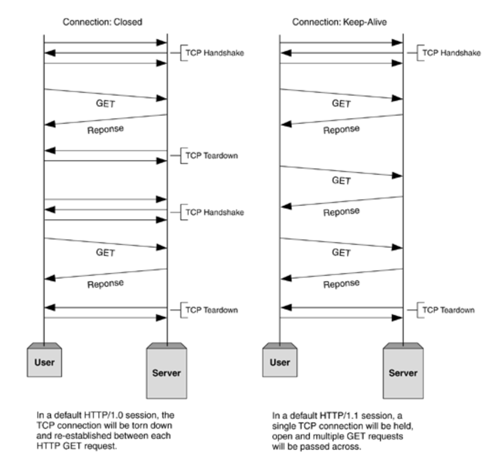

HTTP 1.0은 요청하고 수신할 때마다 새로운 TCP 세션을 맺어야 한다.

반면 HTTP 1.1부터는 TCP 세션을 한 번만 맺으면 여러 개의 요청을 보내고 응답을 수신할 수 있다. (keep-alive)

결과적으로 TCP 세션을 처리하는 비용을 줄이고 응답 속도를 개선할 수 있다.

#### 1.1 파이프라이닝(Pipelining)

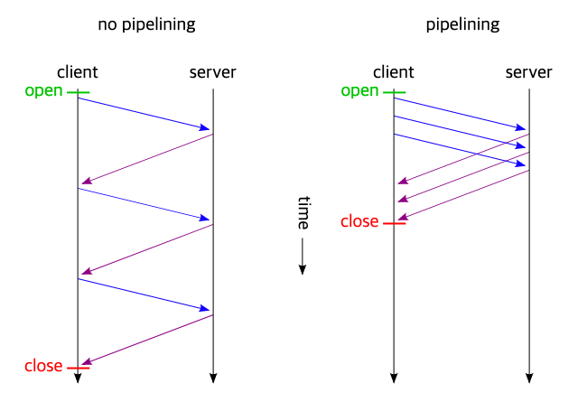

HTTP 1.0 환경에서는 요청에 대한 응답이 와야 다음 요청을 보낼 수 있다.

반면 HTTP 1.1부터는 요청을 병렬로 처리할 수 있는 파이프라이닝 기능을 지원한다.

이는 응답 속도를 높혀 페이지 뷰의 속도를 빠르게 할 수 있다.

### 2. 호스트 헤더(Host Header)

HTTP 1.0 환경에서는 하나의 IP에 하나의 도메인만 운영할 수 있었다.

HTTP 1.1부터는 웹 서버에서 요청 헤더에 호스트를 전달받아 서버로 보내주는 가상 호스팅이 가능해졌다.

즉, 서버 하나가 여러 개의 호스트를 담당할 수 있다. (HTTP 1.1부터는 헤더에 호스트가 없으면 400을 응답한다.)

### 3. 강력한 인증 절차(Improved Authentication Procedure)

HTTP 1.1에서 다음 2개의 헤더가 추가됐다.

- Proxy-Authentication
- Proxy-Authorization

HTTP 1.0에서 클라이언트 인증을 담당하는 www-authentication 헤더는 요청 사이에 프록시가 있을 경우 인증 인가를 수행할 수 없었다.

---

## HTTP 1.1, 2.0

### HOL 블로킹(Head-Of-Line blocking)

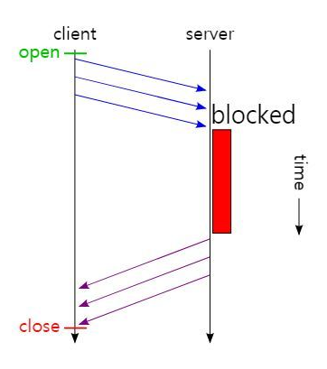

Pipelining을 통해 요청을 한 번에 여러개를 보낼 수 있게 되면서 왕복 시간(Round-Trip time)이 줄어들었고, 응답 지연(Latency)에 매우 좋은 효과를 기대할 수 있었다.

하지만 만약 첫 번째 요청의 처리가 서버에서 늦어질 경우, 두 번째 세 번째 응답이 같이 지연되게 된다.

이를 HOL 블로킹이라 한다.

---

### Multiplexed Streams

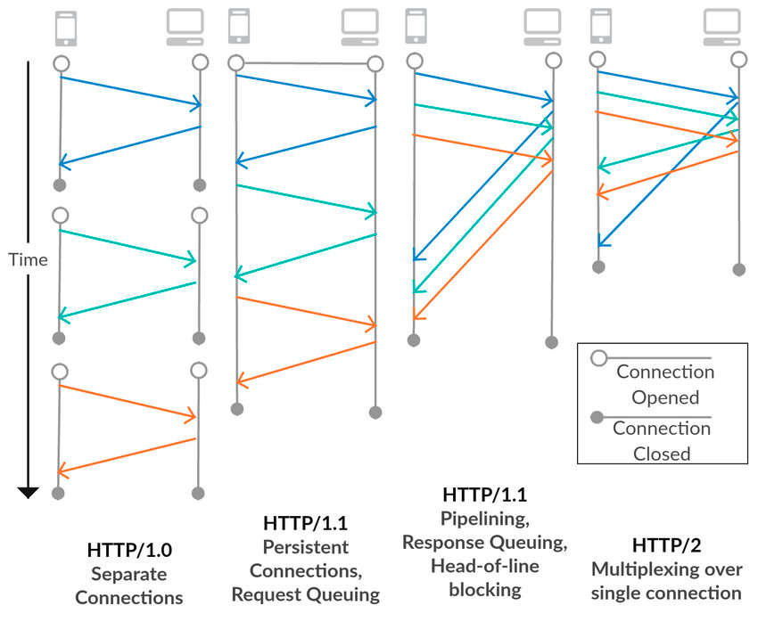

HTTP 2.0에서는 Multiplexed라는 기술을 도입해 하나의 세션으로 여러 개의 요청을 순서 상관 없이 Stream으로 받아 동시다발적으로 
처리하고 응답할 수 있게 됐다.

이는 특정 요청이 끝나면 해당 요청에 먼저 응답함으로써 HOL 블로킹을 해결했다.

### Stream Priorityzation

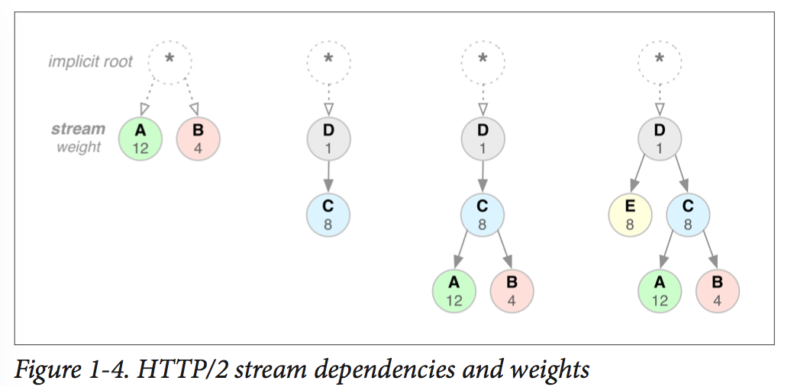

HTTP 2.0에서는 각 요청에 우선 순위(Priority)를 부여한다.

### Server Push

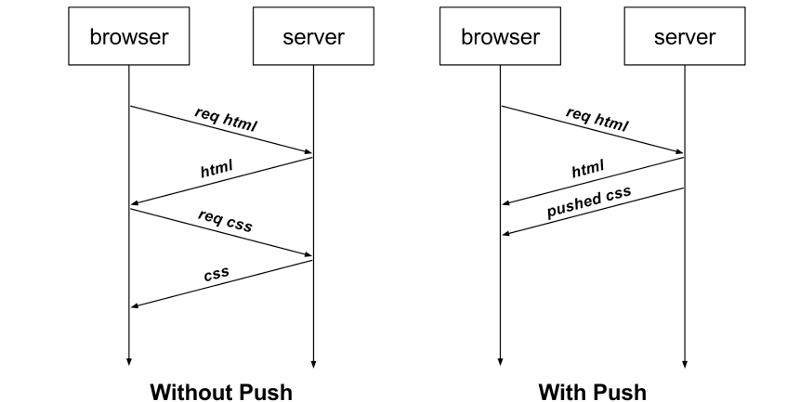

기존에는 HTML 문서를 요청한 후, 해당 문서에서 필요한 CSS와 Images를 요청해야 했다.

HTTP 2.0부터는 HTML 문서를 요청하면, 클라이언트가 추가로 요청하지 않아도 서버가 필요한 리소스를 알아서 보내준다.

### Header Compression

기존에는 이전에 보냈던 요청과 중복되는 헤더도 똑같이 전송하느라 자원을 낭비했다.

HTTP 2.0부터는 허프만 코딩을 사용한 HPACK 압축 방식으로 이를 개선했다.

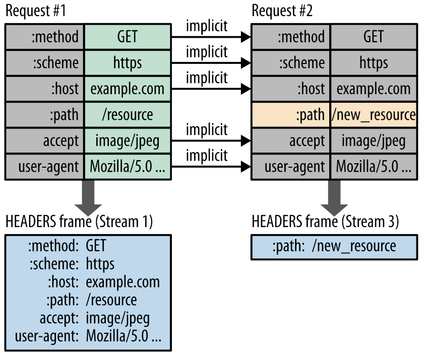

클라이언트와 서버는 각각 Header Table을 관리하고, 이전 요청과 동일한 필드는 table의 index만 보낸다.

변경되는 값은 Huffman Encoding 후 보냄으로써 헤더의 크기를 경량화했다.

`Huffman Coding` 데이터 문자의 빈도에 따라서 다른 길이의 부호를 사용하는 알고리즘

---

## HTTP 3.0

가장 큰 특징은 TCP가 아닌 UDP를 사용한다는 것

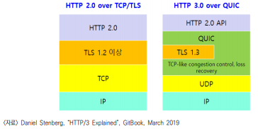

정확히 말하면 HTTP3는 QUIC라는 프로토콜 위에서 돌아가는 HTTP인데, QUIC는 Quick UDP Internet Connection의 
약자로 UDP를 사용하는 프로토콜이다.

TCP는 3 way handshake, 4 way handshake 등 오버헤드와 HOLB의 문제를 피할 수 없다.

QUIC는 TCP hand shake 과정을 최적화하는 것에 초점을 맞춰 설계되었다.

UDP는 데이터그램 방식을 사용하기 때문에 각 패킷 간 순서가 존재하지 않는다.

패킷의 목적지가 정해져있다면 중간 경로는 어딜 타든 신경쓰지 않기 때문에 handshake 과정을 거치지 않고, 따라서 
TCP 방식에 비해 Latency가 굉장히 적지만 신뢰성을 보장하기 어럽다.

#### QUIC

- TCP가 가지고 있는 문제들을 해결하고 Latency의 한계를 뛰어넘고자 구글이 개발한 UDP 기반 프로토콜
- TCP 핸드쉐이크 과정을 최적화하는 것에 초점을 맞춰 설계됐다.
- TCP의 경우 IP 주소와 포트, 연결 대사의 IP 주소와 포트로 연결을 식별하기 때문에 클라이언트의 IP가 바뀌는 상황이 발생할 경우 연결이 끊어진다.
- 이런 경우 다시 3 way handshake 과정을 거치고 Latency가 발생한다.
- 모바일 환경의 경우 wifi와 셀룰러 간 전환이 일어날 경우 클라이언트의 IP가 변경되기 때문에 문제가 될 수 있다.
- QUIC는 클라이언트의 IP와 상관없이 랜덤하게 생성되는 `Connection ID`를 사용하기 때문에 클라이언트의 IP가 변경되더라도 기존의 연결을 계속 유지할 수 있다.
- 즉, Handshake 과정을 생략함으로써 Latency를 줄일 수 있다.

**패킷 손실 감지에 걸리는 시간 단축**

TCP는 송신 측이 패킷을 보낸 후 타이머를 사용해 일정 시간 동안 응답이 오지 않으면 패킷이 손상되었다고 판단해 재전송한다.

이 때 문제는 TCP가 타임아웃을 언제 낼 것인가를 동적으로 계산해야 한다는 것이다.

패킷 전송시 ACK를 받았을 때 첫 번째로 보낸 패킷의 ACK인지 두 번째로 보낸 패킷의 ACK인지 확인해야 한다.

이를 재전송 모호성이라고 한다.

반면 QUIC는 헤더에 별도의 패킷 번호 공간을 부여해 패킷 손실 감지에 걸리는 시간을 단축한다.

---

## HTTP - GET, POST

### GET

데이터를 읽거나 검색할 때 사용되는 메소드

만약 요청이 성공적으로 이루어진다면 XML이나 JSON과 함꼐 200(ok) HTTP 응답 코드를 리턴한다.

에러가 발생하면 주로 404(Not found) 에러나 400(Bad request) 에러가 발생한다.

데이터 변형의 위험 없이 사용할 수 있으며, idempotent(멱등성)하다.

즉, 몇 번을 호출하든지 결과가 동일하다.

### POST

주로 새로운 리소스를 생성할 때 사용된다.

좀 더 구체적으로는 하위 리소스(부모 리소스의 하위 리소스)들을 생성하는 데 사용된다.

성공적으로 creation을 완료하면 201(created) HTTP 응답을 반환한다.

이는 안전하지도, 멱등성을 보장하지도 않는다. 

즉, 같은 POST 요청을 반복해서 했을 때 항상 같은 결과물이 나오는 것을 보장하지 않으며, 
두 개의 같은 POST 요청을 보내면 같은 정보를 담은 두 개의 resource를 반환할 가능성이 높다.

---

## HTTP 요청 헤더 응답 헤더

1. 공통 헤더
2. 요청 헤더
3. 응답 헤더

### 1. 공통 헤더

> 요청과 응답에 모두 사용되는 헤더

1. Date
   1. HTTP 메시지가 만들어진 시간으로, 자동으로 생성된다.

2. Connection
   1. 일반적으로 Http/1.1을 사용하며, 기본적으로 keep-alive로 되어있다.

3. Content-Length
   1. 요청과 응답 메시지의 본문 크기를 바이트로 표시해주며, 자동생성된다.

4. Cache-Control
   1. https://www.blog-dreamus.com/post/cache-control-이-필요한-이유
   2. https://hudi.blog/http-cache/

5. Content-Type
   1. 컨텐츠의 타입(MIME)과 문자열 인코딩(utf-8 등)을 명시할 수 있다.
   2. 서버로 데이터를 보낼 때는 text/html 대신 www-url-form-encoded, multipart/form-data 등이 사용된다.

6. Content-Language
   1. 사용자의 언어

    
7. Content-Encoding
   1. 응답 컨텐츠를 br, gzip, deflate 등의 알고리즘으로 압축해서 보내면, 브라우저가 알아서 해제해서 사용한다.
   2. 요청이나 응답 전송 속도도 빨라지고, 데이터 소모량도 줄어들기 때문에 사용한다.

### 2. 요청 헤더

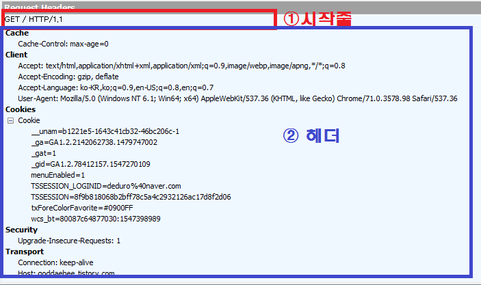

1. Host
   1. 서버의 도메인 네임으로, 반드시 하나가 존재해야 한다.

2. User-Agent
   1. 가장 흔하게 보고 사용되는 헤더
   2. 현재 사용자가 어떤 클라이언트(운영체제, 앱, 브라우저 등)를 통해 요청을 보냈는지 알 수 있다.
   3. 다만 헤더는 변경할 수 있기 때문에 무조건 신뢰할 수는 없다.

3. Accept
   1. 클라이언트가 허용할 수 있는 파일 형식(MIME TYPE)

4. Cookie
   1. 웹 서버가 클라이언트에 쿠키를 저장해놓았다면 해당 쿠키의 정보를 이름-값 쌍으로 웹 서버에 전송한다.

    
5. Origin
   1. POST와 같은 요청을 보낼 때, 요청이 어느 주소에서 시작되었는지를 나타낸다.
   2. 이 때 보낸 주소와 받는 주소가 다르면 CORS 문제가 발생하기도 한다.

6. If-Modified-Since
   1. 페이지가 수정되었을 때 최신 버전 페이지 요청을 위한 필드
   2. 만일 요청한 파일이 이 필드에 지정된 시간 이후로 변경되지 않았다면 서버로부터 데이터를 전송받지 않는다.

7. Authorization
   1. 인증 토큰을 서버로 보낼 때 사용하는 헤더
   2. JWT 토큰을 이용한 인증에서 주로 사용한다.

### 3. 응답 헤더

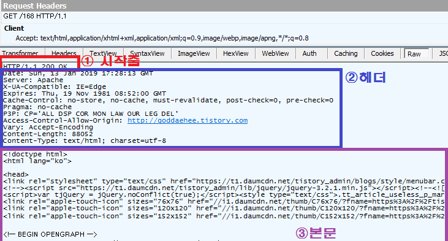

1. Server
   1. 웹 서버 정보를 나타낸다.

2. Access-Control-Allow-Origin
   1. 요청 호스트와 응답 호스트가 다르면 CORS가 발생하는데, 서버에서 응답 메세지 `Access-Control-Allow-Origin` 헤더에 프론트 주소를 적어주면 에러가 발생하지 않는다.

3. Allow
   1. CORS 요청 외에도 적용된다.
   2. ex) Allow:GET, 과 같이 설정할 경우 GET 요청만 받고 POST에는 405 method not allowed 에러를 리턴한다.

    
4. Content-Disposition
   1. 응답 본문을 브라우저가 어떻게 표시해야 할지 알려주는 헤더
   2. inline: 웹페이지 화면에 표시
   3. attachment: 다운로드

    
5. Location
   1. 300번대나 201 created 응답일 때 어느 페이지로 이동해야 할지 알려주는 헤더

6. Content-Security-Policy
   1. 다른 외부 파일들을 불러오는 경우, 차단할 소스와 불러올 소스를 여기에 명시할 수 있다.
   2. 하나의 웹 페이지는 다양한 외부 소스들을 불러온다.(이미지, JS, CSS, 폰트, 아이프레임 등)

---

## HTTP와 HTTPS 동작 과정

### HTTP의 동작 과정

HTTP는 Stateless한 프로토콜이다.

각 요청은 독립적인 트랜잭션으로 클라이언트가 서버에게 요청하기 전에 연결하는 과정이 필요하고, 서버의 응답을 받으면 종료한다.

1. 사용자가 웹 브라우저에 URL 주소를 입력한다.

2. DNS 서버에 웹 서버의 호스트 이름을 IP 주소로 변경 요청한다.

3. 웹 서버와 TCP 연결을 시도한다.
   1. 3 way handshaking

4. 클라이언트가 서버에게 요청한다.
   1. HTTP Request Message = Request Header + 빈 줄 + Request Body
      - Request Header
        - 요청 메소드 + 요청 URI + HTTP 프로토콜 버전
          - `Get /background.png HTTP/1.0` `POST / HTTP 1.1`
          - Header 정보(key-value 구조)
      - 빈 줄
        - 요청에 대한 모든 메타 정보가 전송되었음을 알리는 용도
      - Request Body
      - GET, HEAD, DELETE, OPTIONS처럼 리소스를 가져오는 요청은 바디 미포함
      - 데이터 업데이트와 관련된 내용(HTML 폼 콘텐츠 등)

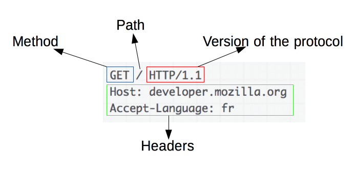

5. 서버가 클라이언트에게 데이터를 응답한다.
    - HTTP Response Message = Response Header + 빈 줄 + Response Body
      - Response Header
        - HTTP 프로토콜 버전 + 응답 코드 + 응답 메시지
        - ex) `HTTP/1.1 Not Found.`
        - Header 정보(key-value) 구조
      - 빈 줄
        - 요청에 대한 모든 메타 정보가 전송되었음을 알리는 용도
      - Response Body
        - 응답 리소스 데이터
        - 201, 204 상태 코드는 바디 미포함

6. 서버 클라이언트 간 연결종료
   1. 4 way handshaking

7. 웹 브라우저가 웹 문서 출력

### HTTPS(SSL)의 동작 과정

공개키 암호화 방식과 대칭키 암호화 방식의 장점을 활용해 하이브리드 사용

데이터를 대칭키 방식으로 암호화, 복호화하고 공개키 방식으로 대칭키 전달

1. 클라이언트가 서버로 접속해 handshaking 과정에서 서로 탐색
   1. Client Hello
      - 클라이언트가 서버에게 전송할 데이터
        - 클라이언트 측에서 생성한 랜덤 데이터
        - 클라이언트-서버 암호화 방식 통일을 위해 클라이언트가 사용할 수 있는 암호화 방식
        - 이전에 이미 handshaking 기록이 있다면 자원 절약을 위해 기존 세션을 재활용하기 위한 세션 아이디
   
   2. Server Hello
      - Client Hello에 대한 응답으로 전송할 데이터
        - 서버 측에서 생성한 랜덤 데이터
        - 서버가 선택한 클라이언트의 암호화 방식
        - SSL 인증서
   
   3. Client 인증 확인
      - 서버로부터 받은 인증서가 CA에 의해 발급되었는지 본인이 가진 목록에서 확인하고, 목록에 있다면 CA 공개키로 인증서 복호화
      - 클라이언트-서버 각각의 랜덤 데이터를 조합하여 pre master secret 값 생성(데이터 송수신 시 대칭키 암호화에 사용할 키)
      - pre master secret 값을 공개키 방식으로 서버 전달(공개키는 서버로부터 받은 인증서에 포함)
      - 일련의 과정을 거쳐 session key 생성

   4. Server 인증 확인
      - 서버는 비공개키로 복호화해 pre master secret 값 취득(대칭키 공유 완료)
      - 일련의 과정을 거쳐 session key 생성

   5. handshaking 종료

2. 데이터 전송
    - 서버와 클라이언트는 session key를 사용해 데이터를 암호화 및 복호화해 데이터 송수신

3. 연결 종료 및 session key 폐기

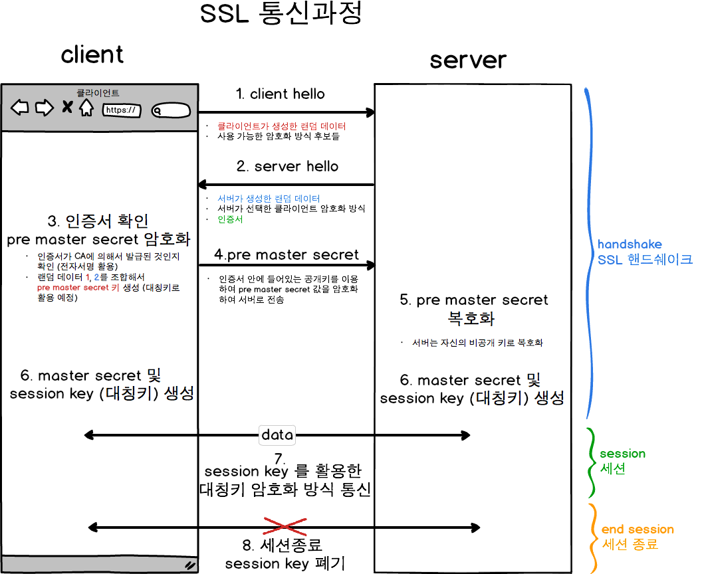

**reference**  
https://jaehoney.tistory.com/279  
https://withbundo.blogspot.com/2021/02/http-http-10-http-11.html  
https://withbundo.blogspot.com/2021/02/httphol-head-of-line-blocking.html  
https://jaehoney.tistory.com/281  
https://velog.io/@kcwthing1210/HTTP-1.1-vs-HTTP-2.0-vs-HTTP-3.0  
https://sujinhope.github.io/2020/10/04/Network-TCP와-UDP,-HTTP1,2,3,-HOLB란.html  
https://im-developer.tistory.com/166  
https://hongsii.github.io/2017/08/02/what-is-the-difference-get-and-post/  
https://goddaehee.tistory.com/169  
https://velog.io/@averycode/네트워크-HTTP와-HTTPS-동작-과정  

SSL

## 보안 소켓 계층(SSL, Secure Sockets Layer)

디지털 인증서로 불리며, 브라우저와 서버 사이의 암호화된 연결을 수립하는 데 사용된다.

웹 사이트와 브라우저 사이 혹은 두 서버 사이에 전송되는 데이터를 암호화해 인터넷 연결을 보호하기 위한 표준 기술

개인 데이터나 금융 데이터 등 전송되는 정보를 보거나 훔치는 것을 방지한다.

웹 사이트가 SSL/TLS로 보호되는 경우 HTTPS가 URL에 표시된다.

### 전송 계층 보안(TLS, Transport Layer Security)

SSL의 향상된, 더욱 안전한 버전

**reference**  
https://www.digicert.com/kr/what-is-ssl-tls-and-https  

CORS

## CORS(Cross-Origin Resource Sharing)

브라우저에서는 보안적인 이유로 cross-origin HTTP 요청들을 제한한다.

그래서 cross-origin 요청을 하려면 서버의 동의가 필요하다.

만약 서버가 동의한다면 브라우저에서는 이를 허락하고, 동의하지 않는다면 브라우저에서 거절한다.

이러한 허락을 구하고 거절하는 메커니즘은 HTTP-header를 이용해서 이루어지게 되는데, 이를 CORS라고 부른다.

즉, 브라우저에서 cross-origin 요청을 안전하게 할 수 있도록 하는 메커니즘으로, 요청을 보낼 수 있도록 돕는 정책이다.

### cross-origin

다음 중 한 가지라도 다른 경우를 말한다.
1. 프로토콜
2. 도메인
3. 포트 번호

https://it-eldorado.tistory.com/163

**reference**  
https://hannut91.github.io/blogs/infra/cors  

REST와 RESTful

REST API를 제공하는 웹 서비스를 RESTful하다고 말할 수 있다.

https://www.youtube.com/watch?v=RP_f5dMoHFc&t=2377s

소켓

## 소켓

네트워크로 연결되어 있는 컴퓨터의 통신의 접점에 위치한 통신 객체

포트 번호에 바인딩되어 TCP 레이어에서 데이터가 전달되어야 하는 애플리케이션을 식별할 수 있게 한다.

다음과 같은 요소로 구성

- 인터넷 프로토콜(TCP, UDP, raw IP)
- 로컬 IP 주소
- 로컬 포트
- 원격 IP 주소
- 원격 포트

**reference**  
https://plummmm.tistory.com/55  
https://www.daleseo.com/what-is-a-socket/

Socket.io와 WebSocket

## Socket.io와 WebSocket

웹소켓은 양방향 소통을 위한 프로토콜

socket.io는 양방향 통신을 하기 위해 웹소켓 기술을 활용하는 라이브러리

### WebSocket

- HTML5 표준 웹 표준 기술
- 매우 빠르게 동작하며 통신할 때 아주 적은 데이터 이용
- 이벤트를 단순히 듣고, 보내는 것만 가능

### Socket.io

- 표준 기술이 아니며, 라이브러리임
- 소켓 연결 실패 시 fallback을 통해 다른 방식으로 알아서 해당 클라이언트와 연결 시도
- 방 개념을 이용해 일부 클라이언트에게만 데이터를 전송하는 브로드캐스팅이 가능

### 사용

서버에서 연결된 소켓(사용자)들을 세밀하게 관리해야하는 경우 Broadcasting 기능이 있는 socket.io를 쓰는 게 유지보수 측면에서 이점이 많다.

반면 가상화폐 거래소와 같이 데이터 전송이 많은 경우 빠르고 비용이 적은 표준 웹소켓을 이용하는 것이 바람직하다.

**reference**  
https://www.peterkimzz.com/websocket-vs-socket-io/

