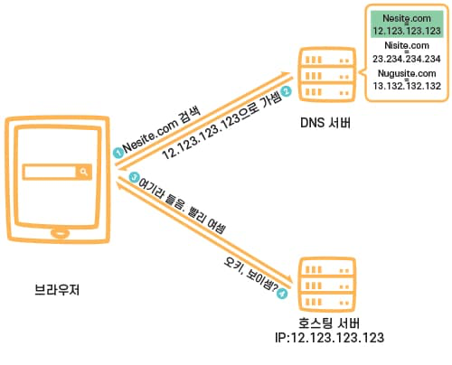

쿠키와 세션

## 쿠키와 세션

**HTTP Protocol**

1. Connectionless
   - 클라이언트가 요청을 한 후 응답을 받으면 그 연결을 끊어버리는 특징
2. Stateless
   - 통신이 끝나면 상태를 유지하지 않는 특징

쿠키와 세션은 위의 두 가지 특징을 해결하기 위해서 사용한다.

쿠키와 세션을 사용했을 경우, 한 번 로그인하면 그 사용자에 대한 인증을 계속 유지하게 된다.

## 쿠키(Cookie)

- 클라이언트(브라우저) 로컬에 저장되는 키와 값이 들어있는 작은 데이터 파일
- 사용자 인증이 유효한 시간을 명시할 수 있으며, 유효 시간이 정해지면 브라우저가 종료돼도 인증이 유지된다는 특징이 있다.
- 쿠키는 클라이언트의 상태 정보를 로컬에 저장했다가 참조한다.
- 클라이언트에 300개의 쿠키 저장 가능, 하나의 도메인 당 20개의 값만 가질 수 있다.
- 하나의 쿠키값은 4kb까지 저장한다.
- Response Header에 Set-Cookie 속성을 사용하면 클라이언트에 쿠키를 만들 수 있다.
- 쿠키는 사용자가 따로 요청하지 않아도 브라우저가 Request 시에 Request Header를 넣어서 자동으로 서버에 전송한다.

**구성 요소**

- 이름: 각 쿠키를 구별하는 데 사용된다.
- 값: 쿠키의 이름과 관련된 값
- 유효 시간: 쿠키 유지시간
- 도메인: 쿠키를 전송할 도메인
- 경로: 쿠키를 전송할 요청 경로

**동작 방식**

1. 클라이언트가 페이지를 요청
2. 서버에서 쿠키 생성
3. HTTP 헤더에 쿠키를 포함시켜 응답
4. 브라우저가 종료돼도 쿠키 만료 기간이 있다면 클라이언트에서 보관하고 있음
5. 같은 요청을 할 경우 HTTP 헤더에 쿠키를 함께 보냄
6. 서버에서 쿠키를 읽어 이전 상태 정보를 변경할 필요가 있을 때 쿠키를 업데이트하여 변경된 쿠키를 HTTP 헤더에 포함시켜 응답

**사용 예**

- 방문 사이트 로그인 시, "아이디와 비밀번호를 저장하시겠습니까?"
- 쇼핑몰 장바구니 기능
- 자동 로그인, "오늘 더 이상 이 창을 보지 않음" 팝업 체크

---

## 세션(Session)

- 쿠키를 기반으로 하지만, 사용자 정보 파일을 브라우저에 저장하는 쿠키와 달리 세션은 서버 측에서 관리한다.
- 서버에서는 클라이언트를 구분하기 위해 세션 ID를 부여하며 웹 브라우저가 서버에 접속해 브라우저를 종료할 때까지 인증상태를 유지한다.
- 접속 시간에 제한을 두어 일정 시간 응답이 없다면 정보가 유지되지 않게 설정할 수 있다.
- 사용자 정보를 서버에 두기 때문에 쿠키보다 보안에 좋지만, 사용자가 많아질 수록 서버 메모리를 많이 사용하게 된다.
- 동접자 수가 많은 사이트의 경우 서버에 과부하를 주게 되므로 성능 저하의 요인이 된다.

**동작 방식**

1. 클라이언트가 서버에 접속 시 세션 ID를 발급 받는다.
2. 클라이언트는 세션 ID에 대해 쿠키를 사용해 저장해서 가지고 있는다.
3. 클라이언트는 서버에 요청할 때 이 쿠키의 세션 ID를 같이 서버에 전달해서 요청
4. 서버는 세션 ID를 전달받아서 별다른 작업 없이 세션 ID로 세션에 있는 클라이언트 정보를 가져와서 사용
5. 클라이언트 정보를 가지고 서버 요청을 처리해 클라이언트에게 응답

**특징**

- 각 클라이언트에게 고유 ID 부여
- 세션 ID로 클라이언트를 구분해서 클라이언트의 요구에 맞는 서비스 제공
- 보안 면에서 쿠키보다 우수
- 사용자가 많아질수록 서버 메모리를 많이 차지하게 된다.

**사용 예**

- 로그인과 같이 보안상 중요한 작업을 수행할 때 사용

### 쿠키와 세션의 차이

- 사용자 정보가 저장되는 위치
  - 세션: 서버
  - 클라이언트: 서버 자원 사용 X

- 보안 면에서 세션이 더 우수하며, 요청 속도는 쿠키가 세션보다 빠르다.
  - 세션은 서버의 처리가 필요하기 때문
  - 쿠키는 클라이언트 로컬에 저장되기 때문에 변질되거나 request에서 스니핑 당할 우려가 있다.
  - 세션은 쿠키를 이용해서 sessionId만 저장하고 그것으로 구분해서 서버에서 처리하기 때문에 비교적 보안성이 좋다.

- 라이프 사이클
  - 쿠키도 만료 시간이 있지만 파일로 저장되기 때문에 브라우저를 종료해도 계속해서 정보가 남아있을 수 있다.
  - 또한 만료 기간을 따로 지정해 쿠키를 삭제할 때까지 유지할 수도 있다.
  - 세션도 만료 시간을 정할 수 있지만 브라우저가 종료되면 만료 시간에 상관없이 삭제된다.

- 속도
  - 쿠키는 클라이언트에 정보가 있기 때문에 서버에 요청 시 속도가 빠르다.
  - 세션은 서버에 정보가 있기 때문에 처리가 요구되어 비교적 느리다.

#### 캐시

- 캐시는 이미지나 css, js 파일 등을 브라우저나 서버 앞단에 저장해놓고 사용하는 것
- 한 번 캐시에 저장되면 브라우저를 참고하기 때문에 서버에서 변경이 되어도 사용자는 변경되지 않은 상태로 보일 수도 있다.
  - 이런 경우 캐시를 지우거나 서버에서 클라이언트로 응답을 보낼 때 header에 캐시 만료 시간을 명시해주면 해결할 수 있다.

---

## 브라우저는 쿠키를 어떻게 저장하는가?

https://velog.io/@haiseong/Set-Cookie로-브라우저에-쿠키-저장하기

**reference**  
https://interconnection.tistory.com/74  

DNS

## DNS(Domain Name System)

- 웹 사이트의 IP 주소와 도메인 주소를 이어주는 환경/시스템

**동작 원리**

https://gentlysallim.com/dns란-뭐고-네임서버란-뭔지-개념정리/  

---

## DNS Round Robin

- DNS 서버 구성 방식 중 하나
- Domain에 대한 IP 요청 쿼리 시 round-robin 방식으로 IP를 반환한다.
- 선점형 스케줄링 중 하나로, 프로세스들 사이에 우선순위를 두지 않고 순서대로, 시간단위로 CPU를 할당하는 방식의 CPU 스케줄링 알고리즘

**단점**

- 서버의 수만큼 공인 IP 주소가 필요하다.
- 균등하게 분산되지 않는다.
- 서버가 다운돼도 확인이 불가능하다.

**해결 방법**

- 다중화 구성 방식(Synchronous Time-Division Multiplexing)
- 가중치 편성 방식(Weighted round robin)
- 최소 연결 방식(Least connection)

**reference**  
https://gentlysallim.com/dns란-뭐고-네임서버란-뭔지-개념정리/  
https://velog.io/@eu_nzi/네트워크-DNS-round-robin의-방식  
http://dailusia.blog.fc2.com/blog-entry-362.html  
https://yaelimeee.tistory.com/46?category=962256

CDN

## CDN(Contents Delivery Network)

- 데이터 사용량이 많은 애플리케이션의 웹 페이지 로드 속도를 높이는 상호 연결된 서버 네트워크
- 사용자가 웹 사이트를 방문할 때 웹 사이트 서버의 데이터가 인터넷을 통해 사용자의 컴퓨터에 도달하게 된다.
- 사용자가 해당 서버에서 멀리 떨어져 있는 경우 동영상이나 이미지와 같은 대용량 파일을 로드할 때 많은 시간이 거린다.
- 이 때 사용자와 가까운 거리에 있는 CDN 서버에 웹 사이트 콘텐츠를 저장해놓으면 사용자는 훨씬 빠른 속도로 콘텐츠를 로드할 수 있다.
- 즉, 콘텐츠 전송 시간을 줄여주는 네트워크이다.

**장점** 

- 페이지 로드 시간 단축
- 대역폭 비용 절감
- 콘텐츠 가용성 제고
- 웹 사이트 보안 강화

**사용**

- 고속 콘텐츠 전송
- 실시간 스트리밍
- 다중 사용자 확장

**reference**  
https://aws.amazon.com/ko/what-is/cdn/  
https://code-lab1.tistory.com/261

LRU 캐싱

## LRU(Least Recently Used)

- 운영체제의 페이지 교체 알고리즘 중 하나
- 페이지를 교체할 때 가장 오랫동안 사용되지 않은 페이지를 교체 대상으로 삼는 기법

## LRU Cache

- 캐시에 공간이 부족할 때 가장 오랫동안 사용하지 않은 항목ㅇ르 제거하고 새로운 캐시를 배치하는 형식으로 동작된다.
- 오랫동안 사용되지 않은 항목은 앞으로도 사용되지 않을 가능성이 농후하기 때문에, 가장 오랫동안 참조되지 않은 녀석을 캐시에서 제거하자
- 캐시 히트율을 높게 유지할 수 있으며, 가장 많이 사용하는 알고리즘

**reference**  
https://velog.io/@haero_kim/LRU-Cache-이해하기

daum.net을 쳤을 때 일어나는 과정을 네트워크 관점에서 설명하기

1. 사용자가 브라우저에 도메인 네임을 입력한다.

2. 도메인 네임 조회(Local)
   - DNS 서버에 질의하기 전에 먼저 브라우저의 DNS 캐시를 확인해서 도메인에 대한 정보가 있는지 확인한다.
   - 해당 캐시가 존재하지 않는다면 로컬의 hosts 파일에 도메인에 대한 정보가 있는지 확인한다.
   - 해당 정보도 존재하지 않는다면 라우팅을 거쳐 DNS 서버에 질의한다.

3. 라우팅
   - 대부분의 가정집에서는 DHCP로 인터넷에 접속한다.
   - `DHCP(Dynamic Host Configuration Protocol` 호스트의 IP 주소 및 TCP/IP 설정을 클라이언트에 자동으로 제공하는 프로토콜
   - 사용자들은 DHCP 서버에 자신의 시스템을 위한 IP 주소를 요청하고, IP를 부여받으면 다른 호스트와 TCP/IP를 사용해서 통신할 수 있게 된다.
   - 이때 추가로 가장 가까운 라우터의 IP 주소, 가장 가까운 DNS 서버의 IP 주소를 추가로 전달받는다.
   - 해당 IP 주소를 ARP 프로토콜을 이용해서 MAC 주소를 구해야 한다.
     - LAN에서 단말과 단말 간 통신을 하기 위해서는 IP 주소와 함께 MAC 주소도 필요하다.
   - `ARP`
     - IP 주소와 MAC 주소를 일대일 매칭해 ARP Table에 저장한다.
     - 저장한 ARP Table을 사용해서 동일한 IP를 가진 여러 개의 장비 중에서도 정확한 목적지에 찾아갈 수 있도록 돕는다.

4. DNS에 도메인 정보 질의
  - 라우팅을 거쳐서 가장 가까운 DNS 서버(local)와 통신해서 도메인의 IP로 요청을 보내야 한다.
  1. Local DNS에 해당 IP 정보가 있으면 가져온다.
  2. 만약 없다면 Root DNS 서버에 `www.daum.net`에서 net의 정보가 있는지 확인한다.
  3. (없다면 404) 있다면 net DNS로 요청을 보내서 daum의 정보가 있는지 확인한다.
  4. (없다면 404)) 있다면 daum.net DNS로 요청을 보내서 `www.daum.net`의 정보를 가져온다.
  5. Local DNS는 `www.daum.net`에 대한 주소를 캐시로 저장한다.
  6. Local DNS에서 `www.daum.net`에 대한 주소 정보를 저장한다.

5. TCP 커넥션(초기 연결)
  - 이제 실제 `www.daum.net`과 통신하기 위해 TCP 커넥션을 맺는다.
  - 3-way handshake 사용

6. HTTP 요청
  - TCP 커넥션에 성공하면 연결된 TCP 소켓으로 HTTP Request를 보낸다.

7. 컨텐츠 다운로드
  - 뷰를 렌더링하기 위해 HTTP, CSS, Javascript 또는 해당 페이지에서 필요한 image src 등을 다운로드한다.
  - 만약 유효한 캐시가 존재한다면 해당 캐시를 사용할 수 있다.
  - 공유 프록시 캐시와 브라우저 캐시에서 해당 리소스가 있는지 확인한다.
    - 공유 프록시 캐시
      - 클라이언트와 서버의 중간에서 한 명 이상의 사용자에 의해 재사용되는 응답을 저장하는 캐시
      - 웹서버, 프록시 서버, CDN 
    - 브라우저 캐시
      - 브라우저에서 자체적으로 저장하는 로컬 스토리지, 쿠키 등

  
8. 브라우저 렌더링
  - 브라우저 렌더링을 통해 사용자에게 뷰가 보여지고 TCP 연결을 종료하게 된다.

**reference**  
https://jaehoney.tistory.com/74  
https://jaehoney.tistory.com/289  
https://github.com/WooVictory/Ready-For-Tech-Interview/blob/master/Network/주소창에%20naver.com을%20치면%20일어나는%20일.md  

