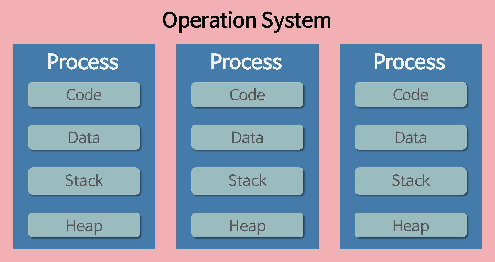
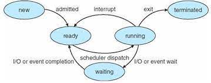
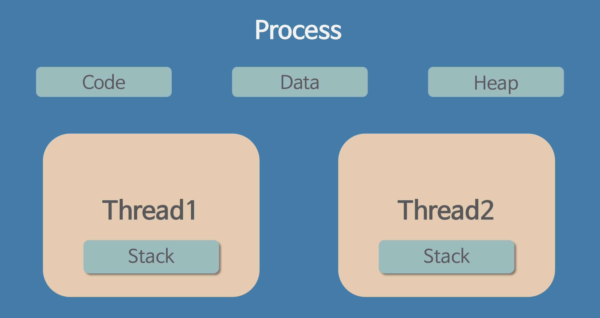
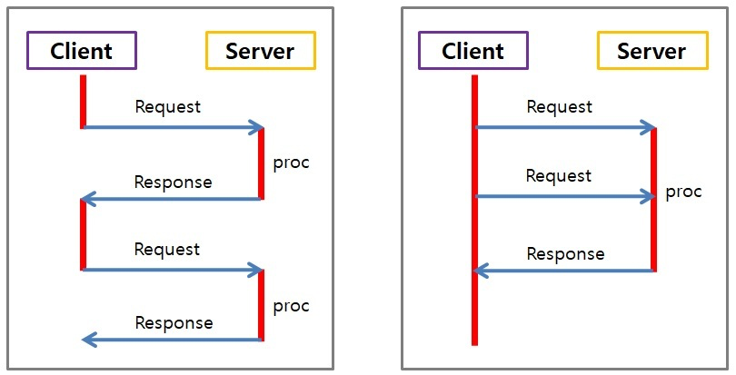

프로세스와 스레드의 차이

## 프로세스

- 메모리 상에서 실행중인 프로그램
- 최소 하나의 스레드를 보유하고 있으며, 각각 별도의 주소 공간을 독립적으로 할당받는다. (code, data, heap, stack)

**특징**

- 최소 1개의 스레드를 가지고 있다.
- 각 프로세스는 별도의 주소 공간에서 실행되며, 한 프로세스는 다른 프로세스는 다른 프로세스의 변수나 자료구조에 접근할 수 없다.
- 다른 프로세스의 자원에 접근하려면 프로세스 간의 통신(IPC, Inter-Process Communication)을 사용해야 한다.
  - ex) 파이프, 파일, 소켓 등을 이용한 통신

- code
  - 실행할 프로그램의 코드나 명령어들이 기계어 형태로 저장된 영역
  - CPU는 코드 영역에 저장된 명령어들을 하나씩 처리한다.

- data
  - 코드에서 선언한 전역 변수와 정적 변수가 저장되는 영역
  - 프로그램이 실행되면서 할당되고 종료되면서 소멸한다.

- stack
  - 함수 안에서 선언된 지역변수, 매개변수, 리턴값 들이 저장되는 영역
  - 함수 호출시 기록되고 종료되면 제거된다.

- heap
  - 관리가 가능한 데이터 이외의 다른 형태의 데이터를 관리하기 위한 자유공간

---

## 스레드

- 프로세스 안에서 실행되는 흐름 단위
- 프로세스의 특정한 수행 경로
- 프로세스가 할당받은 자원을 이용하는 실행의 단위
- stack만 따로 할당받고 나머지 영역은 스레드끼리 서로 공유

**특징**

- 스레드는 프로세스 내에서 각각 stack만 따로 할당받고 code, data, heap 영역은 공유한다.
- 각각의 스레드는 별도의 레지스터와 스택을 갖고 있지만, 힙 메모리는 서로 읽고 쓸 수 있다.
- 한 스레드가 프로세스 자원을 변경하면, 다른 이웃 스레드(sibling thread)도 그 변경 결과를 즉시 볼 수 있다.

**reference**  
https://velog.io/@aeong98/운영체제OS-프로세스와-스레드

 멀티프로세스, 멀티스레드, 병렬프로그래밍 

## 멀티프로세스

- 두 개 이상 다수의 프로세서(CPU)가 협력적으로 하나 이상의 작업(Task)을 동시에 처리하는 것
- 각 프로세스 간 메모리 구분이 필요하거나 독립된 주소 공간을 가져야 할 경우 사용

**장점**

- 독립된 구조로 안정성이 높다.
- 프로세스 중 하나에 문제가 생겨도 다른 프로세스에 영향을 주지 않는다.

**단점**

- 멀티스레드보다 많은 메모리 공간과 CPU 시간을 차지한다.
- 독립된 메모리 영역이기 때문에 작업량이 많을수록, `Context Switching`이 자주 일어나서 주소 공간의 공유가 잦을 경우 오버헤드가 발생해 성능 저하가 발생할 수 있다.
- `Context Switching` 과정에서 캐시 메모리 초기화 등 무거운 작업이 실행되면서 오버헤드 발생

`Context Switching`
- CPU는 한 번에 하나의 프로세스만 실행 가능
- CPU에서 여러 프로세스를 돌아가면서 작업을 처리하는데 이 과정을 말한다.
- 즉, 동작 중인 프로세스가 대기하면서 해당 프로세스 상태(Context)를 보관하고, 대기하고 있던 다음 순서의 프로세스가 동작하면서 이전에 보관했던 프로세스의 상태를 복구하는 작업

---

## 멀티스레드

- 하나의 프로세스에 여러 스레드로 자원을 공유하며 작업을 나누어 수행하는 것

**장점**

- Context Switching 할 때 공유하고 있는 메모리만큼 메모리 자원을 아낄 수 있다.
- 프로세스 내의 stack 영역을 제외한 모든 메모리를 공유하기 때문에 통신 부담이 적어 응답 시간이 빠르다.

**단점**

- 스레드 하나가 프로세스 내 자원을 망치면 모든 프로세스가 종료될 수 있다.
- 자원을 공유하기 때문에 필연적으로 동기화 문제가 발생할 수밖에 없다. 교착상태가 발생하지 않도록 주의해야 한다.

_동기화 문제(Synchronization Issue)_

멀티스레드를 사용하면 각각의 스레드 중 어떤 것이 어떤 순서로 실행될지 그 순서를 알 수 없다. 

만약 A 스레드가 어떤 자원을 사용하다가 B 스레드로 제어권이 넘어간 후 B 스레드가 해당 자원을 수정했을 때, 다시 제어권을 받은 A 가 해당 자원에 접근하지 못하거나, 바뀐 자원에 접근하게 되는 오류가 발생할 수 있다.

스케줄링은 운영체제가 자동으로 구현해주지 않기 때문에 프로그래머가 적절한 기법을 직접 구현해야 하므로 프로그래밍을 할 때 멀티스레드를 사용하려면 신중해야 한다.

---

## 병렬프로그래밍

https://hbase.tistory.com/308

https://velog.io/@honeyoung_0117/병렬처리

**reference**  
https://velog.io/@xxhaileypark/멀티-스레드Multi-Thread-멀티-프로세스Multi-process

동기 비동기 / blocking non-blocking

## 동기(Synchronous)와 비동기(Asynchronous)

### 동기

- 요청과 그 결과가 동시에 일어나는 것
- 요청 후 결과가 와야만 그 다음 작업이 이루어진다.

- 간단하고 직관적
- 호출한 쪽에서 작업 완료 여부를 신경 쓴다.

### 비동기

- 요청과 그 결과가 동시에 일어나지 않는 것
- 요청 후 결과가 오는 동안 그 다음 작업이 이루어지는 방식

- 동기보다 복잡
- 어떠한 일을 처리하는 동안 다른 일을 할 수 있어 자원을 효율적으로 사용할 수 있다.
- 호출된 쪽에서 작업 완료 여부를 신경 쓴다.

---

## blocking non-blocking

### Blocking

- 호출된 함수가 자신의 작업을 모두 끝낼 때까지 제어권을 가지고 있어 호출한 함수가 대기하도록 한다.

### Non-Blocking

- 호출된 함수가 바로 return해서 호출한 함수에게 제어권을 줌으로써 다른 일을 할 수 있게 한다.

### Non-Blocking & Synchronous

- Non-Blocking은 바로 리턴해서 제어권을 넘겨주고, 동기는 작업 완료 여부를 호출한 쪽에서 신경쓴다.
- 즉, 호출을 하면 바로 반환이 되고, 다른 일을 수행하는데 작업이 완료되었는지 계속 물어보는 일을 추가로 수행한다.

### Blocking & Asynchronous

- Blocking은 작업이 끝날 때까지 제어권을 계속 가지고 있고, 비동기는 작업 완료 여부를 호출된 쪽에서 신경쓴다.

**reference**  
https://velog.io/@daybreak/동기-비동기-처리  
https://velog.io/@soyeon207/동기-비동기-blocking-non-blocking  
https://lu-coding.tistory.com/15

