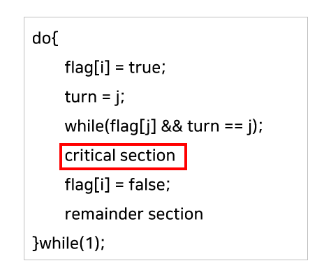
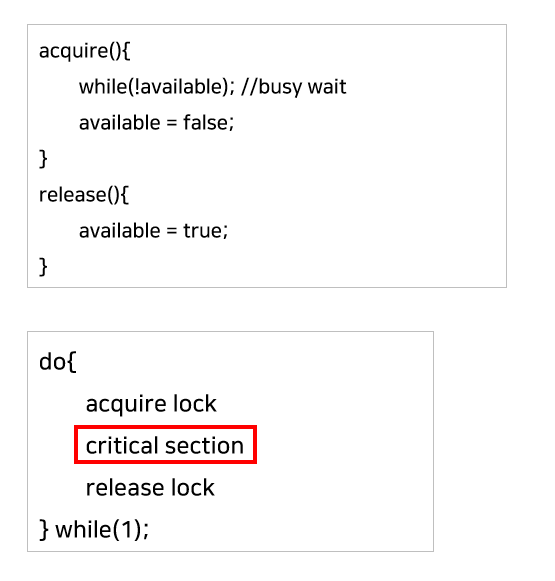
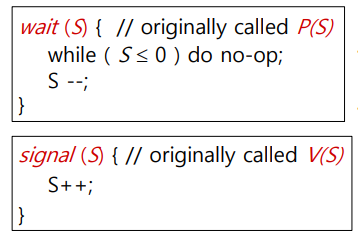

<details>

<summary>프로세스 동기화</summary>

## 프로세스 동기화(Process Synchronization)

여러 프로세스가 공유하는 자원의 일관성을 유지하는 것

여러 프로세스가 서로 협력해 공유 자원을 사용할 때 경쟁 상황(race condition)이 발생하면 공유 자원의 신뢰성이 떨어진다.

이를 방지하기 위해 프로세스들이 공유자원을 사용할 때 특별한 규칙을 만드는 것

### _경쟁 상황(race condition)_

- 여러 프로세스(또는 스레드)가 동일한 자료에 접근해 조작하고, 그 실행 결과가 접근이 발생한 특정 순서에 의존하는 상황
  - 동시에 접근할 때 자료의 일관성을 해치는 결과가 나올 수 있다.


- 공유 데이터의 동시 접근은 데이터의 불일치 문제를 발생시킬 수 있다.
- 따라서 경쟁 상태를 막고 일관성을 유지하기 위해서는 협력 프로세스 간의 실행 순서를 정해주는 메커니즘인 동기화가 필요하다.


### 임계구역(critical section)
  - Race Condition이 발생할 수 있는 특정 부분
  - 즉, 공유 데이터에 접근하는 코드 부분
  - 다른 프로세스와 공유하는 변수를 수정하거나, 테이블을 갱신하거나 파일을 수정하거나 하는 등의 작업이 수행된다.

### 임계구역 문제(The Critical-Section Problem)

- 프로세스들이 협력할 때 사용할 수 있는 프로토콜을 설계하는 것

```
do {
    entry section
        critical section
    excit section
        remainder section
}
```
전형적인 프로세스의 일반적인 구조

- 진입 구역(entry section)
  - 임계구역으로 진입하기 위해 진입 허가를 요청하는 부분
- 퇴출 구역(exit section)
- 나머지 구역(remainder section)


#### Solution

임계구역 문제에 대한 해결책은 다음의 세 가지 요구조건을 충족해야 한다.

1. 상호 배제(Mutual Exclusion)
   - 한 프로세스가 자신의 임계구역에서 작업 중이면 다른 모든 프로세스는 그들 자신의 임계구역에서 실행될 수 없다.


2. 진행(Progress)
   - 자신의 임계구역에서 실행되는 프로세스가 없고, 그들 자신의 임계구역으로 진입하려고 하는 프로세스들이 있다면
   - 나머지 구역에서 실행 중이지 않은 프로세스들만 다음에 그 누가 그 임계구역으로 진입할 수 있는지를 결정하는 데 참여할 수 있으며, 이 선택은 무한정 연기될 수 없다.


3. 한정 대기(Bounded Waiting)
   - 프로세스가 임계구역에 들어가기 위해 요청한 후부터 그 요청이 허용될 때까지 다른 프로세스들이 그들 자신의 임계구역에 들어가는 횟수에 한계가 있어야 한다.
   - 즉, Critical Section에 진입하려는 프로세스가 무한정 기다려서는 안된다.


#### Synchronization Algorithm

**Peterson's Solution**



Pi 프로세스에 대해서, Pi는 flag[i] = true로 바꾸면서 Critical Section에 진입하려고 한다. 

그리고 turn = j로 바꿔주면서 상대방이 들어가게 한다. 

만약 상대방이 들어가고 싶고 (flag[j] == true), 현재 상대방이 Critical Section에 들어가 있으면 (turn == j) 기다린다. 

그렇지 않으면 Pi가 들어간다.

그리고나서 Critical Section을 빠져나오면 들어가고 싶지 않다고 flag[i] = false로 바꿔준다.

다만 Critical Section 진입을 기다리면서 계속 CPU와 메모리를 사용하는 Busy Waiting의 문제가 있다.


#### Synchronization Hardware

https://rebro.kr/176


#### Mutex Lock

임계구역 문제를 해결하기 위한 소프트웨어 도구 중 가장 간단한 방법

- Mutex locks은 lock이 하나만 존재할 수 있는 locking 메커니즘을 따른다.
- 즉, 이미 하나의 프로세스가 Critical Section에서 작업 중이면 다른 프로세스들은 Critical Section에 들어갈 수 없도록 한다.
- Lock을 걸고 푸는 동작은 하드웨어 방식처럼 atomic 하게 수행된다.



**장점**

- 락을 기다리는 동안 상당한 시간을 소모하는 문맥 교환을 전혀 필요로 하지 않는다.
- 따라서 프로세스들이 짧은 시간 동안만 락을 소유할 것이라고 예상될 떄 유용하다.

**단점**

- busy waiting
  - 프로세스가 임계구역에 있는 동안 임계구역에 들어가길 원하는 다른 프로세스들은 acquire() 함수를 호출하는 반복문을 계속 실행해야 한다.
  - 이는 다른 프로세스가 더 생산적인 작업에 사용할 수 있었던 CPU 사이클을 낭비하게 한다.


#### 세마포(Semaphores)

- mutex와 유사하게 동작하지만 프로세스들이 자신들의 행동을 좀 더 정교하게 동기화 할 수 있는 방법을 제공하는 강력한 도구
- Busy Waiting이 필요 없으며, 여러 프로세스나 스레드가 Critical Section에 진입할 수 있는 Signaling 메커니즘이다.


세마포어는 카운터(Counter)를 이용하여 동시에 자원에 접근할 수 있는 프로세스를 제한한다.

주로 S라는 정수형 변수로 나타내며, 이는 사용 가능한 자원의 개수를 의미한다.

또 세마포어 변수는 오직 두 개의 atomic 한 연산을 통해서 접근할 수 있다. 한 프로세스가 세마포어 변수를 수정할 때 다른 프로세스가 동시에 같은 세마포어 변수를 수정할 수 없다.



P(S)는 공유 데이터를 획득하는 연산이고, V(S)는 반납하는 연산이다.


**reference** <br>
https://eunsolsblog.tistory.com/20 <br>
https://rebro.kr/176 <br>
https://velog.io/@woosung0420k/프로세스-동기화-Process-Synchronization <br>
https://hongku.tistory.com/17

</details>

<details>

<summary>Context Switching</summary>

## 문맥 교환(Context Switch)

CPU를 다른 프로세스로 교환하려면 이전의 프로세스 상태를 보관하고 새로운 프로세스의 보관된 상태를 복구하는 작업이 필요하다.

이 작업을 문맥 교환이라고 하며, 문맥 교환이 일어나면 커널은 과거 프로세스의 문맥을 PCB에 저장하고, 실행이 스케줄된 새로운 프로세스의 저장된 문맥을 복구한다.

문맥 교환이 진행될 동안 시스템이 아무런 유용한 일을 못하기 때문에 문맥 교환 시간은 순수한 오버헤드다.

교환 속도는 메모리의 속도, 반드시 복사되어야 하는 레지스터의 수, 특수 명령어의 존재에 좌우되므로, 기계마다 다르다.

</details>

<details>

<summary>스케줄러</summary>

## CPU 스케줄링
다중 프로그래밍의 목적은 CPU 이용을 최대화하기 위해 항상 어떤 프로세스가 실행되도록 하는 데 있다.

시분할의 목적은 각 프로그램이 실행되는 동안 사용자가 상호 작용할 수 있도록 프로세스들 사이에서 CPU를 빈번하게 교체하는 것이다.

이 목적을 달성하기 위해서 프로세스 스케줄러는 CPU에서 실행 가능한 여러 프로세스들 중에서 하나의 프로세스를 선택한다.

---

## 스케줄러(Scheduler)

프로세스는 일생 동안에 다양한 스케줄링 큐들 사이를 이주한다.

운영체제는 어떤 방식으로든 스케줄링 목적을 위해 프로세스들을 이들 큐에서 반드시 선택해야 한다.

선택 절차는 적절한 스케줄러에 의해 수행된다.

### 장기 스케줄러(잡 스케줄러)

- 다중 프로그래밍의 정도(메모리에 있는 프로세스들의 수, degree of multiprogramming) 제어
- 디스크와 메모리 사이의 스케줄링 담당
- 어떤 프로세스에 메모리를 할당하여 ready queue로 보낼지 결정하는 역할
- 단기 스케줄러에 비해 실행 빈도수가 훨씬 적다.


### 단기 스케줄러(CPU 스케줄러)

- 메모리와 CPU 사이의 스케줄링 담당
- 어떤 프로세스를 running 상태로 전환시킬지 결정하는 역할
- CPU를 위해 반드시 자주 새로운 프로세스를 선택해야 한다.
- 백 밀리초마다 최소한 한 번씩 실행된다.
- 실행 간격이 짧기 때문에 반드시 매우 빨라야 한다.


### 중기 스케줄러(medium-term scheduler)

- 시분할 시스템과 같은 일부 운영체제들은 추가로 중간 수준의 스케줄링을 도입한다.
- 핵심 아이디어는 메모리에서 CPU를 위해 적극적으로 경쟁하는 프로세스들을 제거함으로써 다중 프로그래밍의 정도를 완화하는 것이 바람직할 수 있다는 것이다.
- 차후에 다시 프로세스를 메모리로 불러와서 중단되었던 지점에서부터 실행을 재개하고, 이러한 기법을 스와핑이라고 한다.
- 스와핑은 프로세스 혼합 상태를 개선하기 위해 필요하기도 하며, 메모리 요구에 대한 변화가 가용 메모리에 비해 너무 많은 요구를 수용해 메모리를 자유화시키기 위해 필요하기도 하다.


</details>


<details>

<summary>교착 상태(Deadlock)의 개념과 조건</summary>

## Deadlock

즉둘 이상의 프로세스가 다른 프로세스가 점유하고 있는 자원을 서로 기다릴 때 무한 대기에 빠지는 상황

다음 네 가지 조건이 동시에 성립될 때 발생할 수 있다.

1. 상호 배제(Mutual exclusion)
   - 최소한 하나의 자원이 비공유 모드로 점유되어야 한다.
   - 비공유 모드에서는 한 번에 한 프로세스만이 그 자원을 사용할 수 있다.
   - 다른 프로세스가 그 자원을 요청하면, 요청 프로세스는 자원이 방출될 때까지 반드시 지연되어야 한다.


2. 점유하며 대기(Hold-and-wait)
    - 프로세스는 최소한 하나의 자원을 점유한 채, 현재 다른 프로세스에 의해 점유된 자원을 추가로 얻기 위해 반드시 대기해야 한다.


3. 비선점(No preemption)
   - 자원들을 선점할 수 없어야 한다.
   - 즉, 자원이 강제적으로 방출될 수 없고, 점유하고 있는 프로세스가 태스크를 종료한 후 그 프로세스에 의해 자발적으로만 방출될 수 있다.


4. 순환 대기(Circular wait)
    - 대기 프로세스의 집합이 순환 형태로 자원을 대기하고 있어야 한다.


### 처리 방법

1. 예방(prevention)

발생조건 4가지 중 하나라도 발생하지 않게 한다.

- 상호배제: 한 번에 여러 프로세스가 공유 자원 사용 가능
- 점유 대기: 프로세스가 실행되기 전에 자신의 모든 자원을 요청하고 할당받을 것을 요구한다.
- 비선점: 어떤 자원을 점유하고 있는 프로세스가 즉시 할당할 수 엇는 다른 자원을 요청하면 현재 점유하고 있는 모든 자원들이 선점된다.
- 순환 대기: 모든 자원 타입들에게 전체적인 순서를 부여하여, 각 프로세스가 열거된 순서대로 오름차순으로 자원을 요구하도록 한다.


2. 회피

요청 방법에 제한을 두어 교착상태를 예방한다.

교착상태 필요조건 중 적어도 한 가지는 성립되지 않도록 보장한다.

- 은행원 알고리즘(Banker's Algorithm)

다익스트라가 제안한 기법으로, 자원 할당 여부를 결정하기 전에 사전에 모든 자원의 최대 할당량을 가지고 시뮬레이션해서 
안전 상태에 든다면 할당


3. 탐지

- Allocation, Request, Available, 자원 할당 그래프 등으로 시스템에 데드락이 발생했는지 탐색
- 현재 자원 할당 상태를 가지고 파악


4. 회복

- 프로세스 종료
  - 교착 상태 프로세스 모두 중지
  - 교착상태가 제거될 때까지 한 프로세스씩 중지


- 자원 선점
  - 희생자 선택(selection of a victim)
  : 어느 자원과 어떤 프로세스들이 선택될 것인가?
  - 후퇴(rollback): 프로세스를 중지시키고 재시작
  - 기아 상태(starvation): 프로세스가 한정된 시간 동안만 희생자로 선정된다는 것을 보장해야 한다.


</details>
